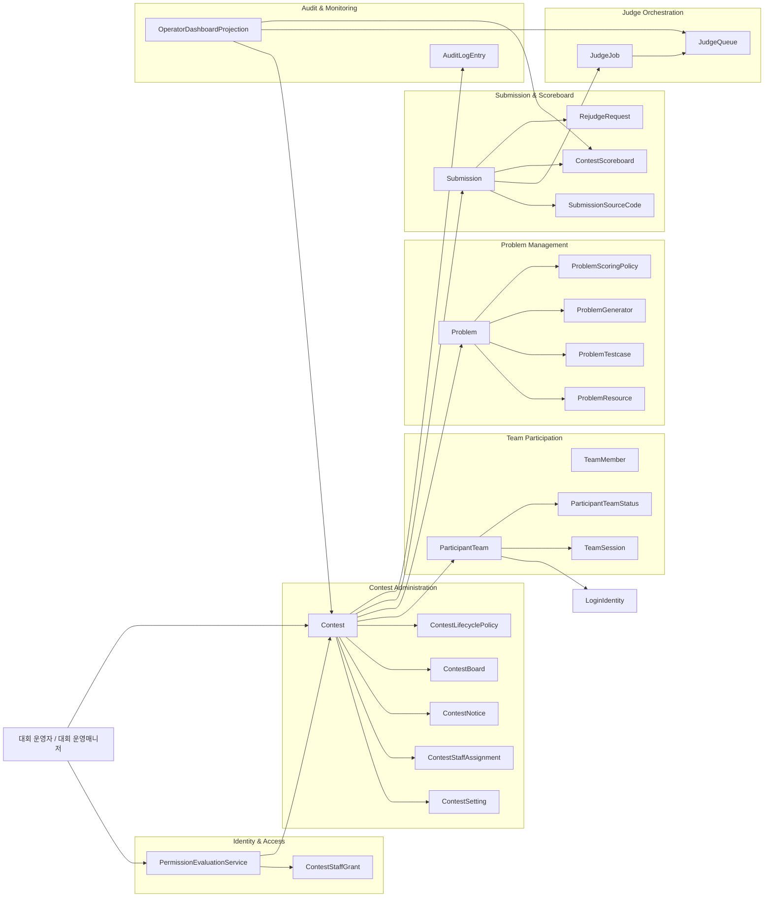
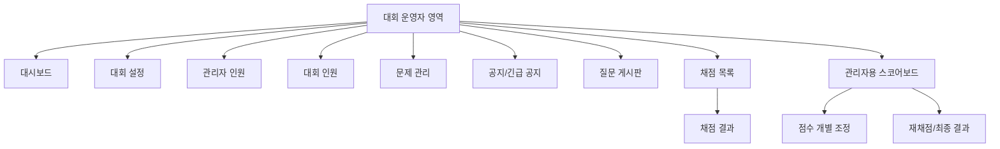
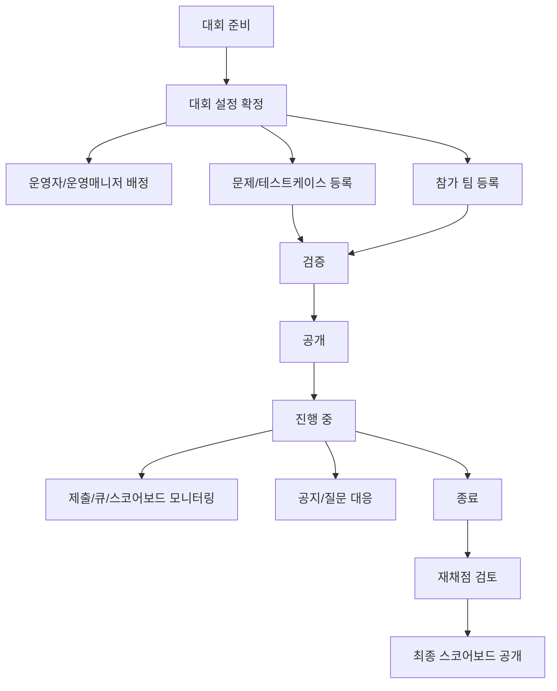
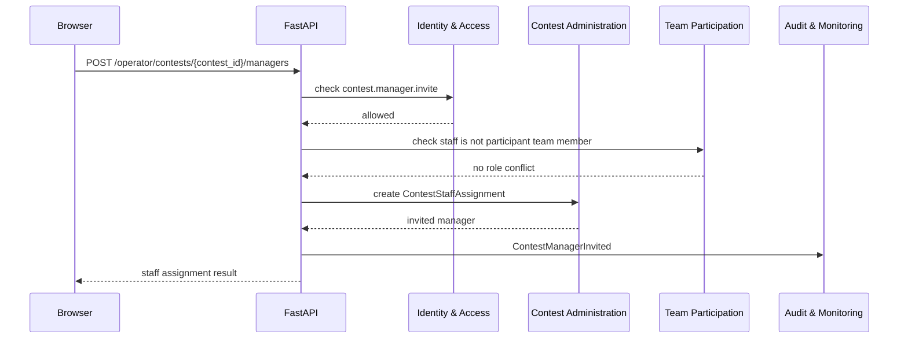
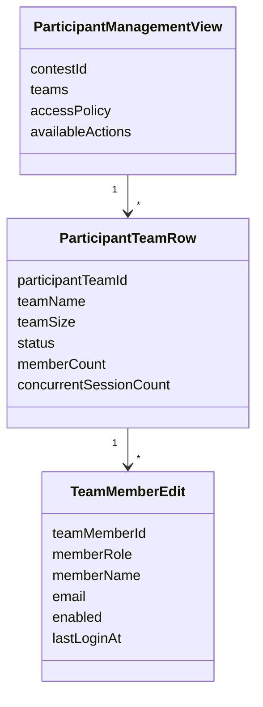
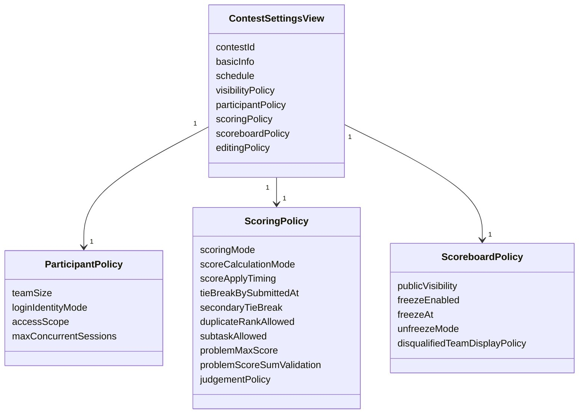
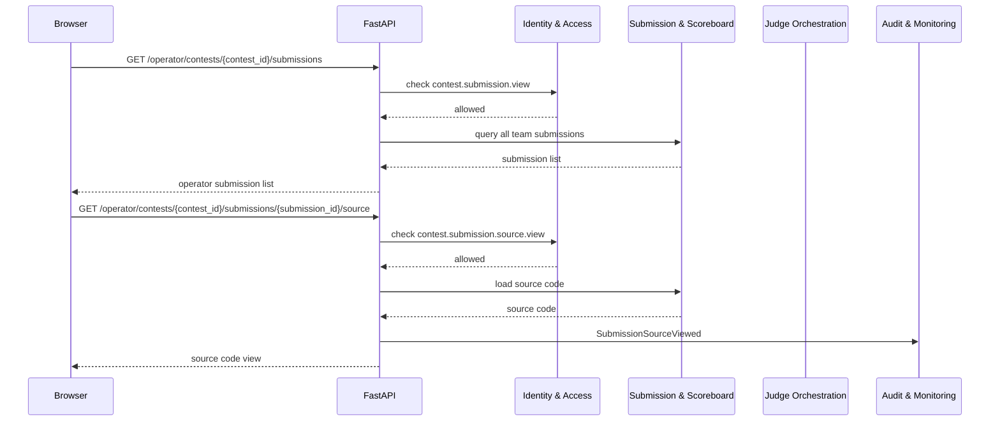
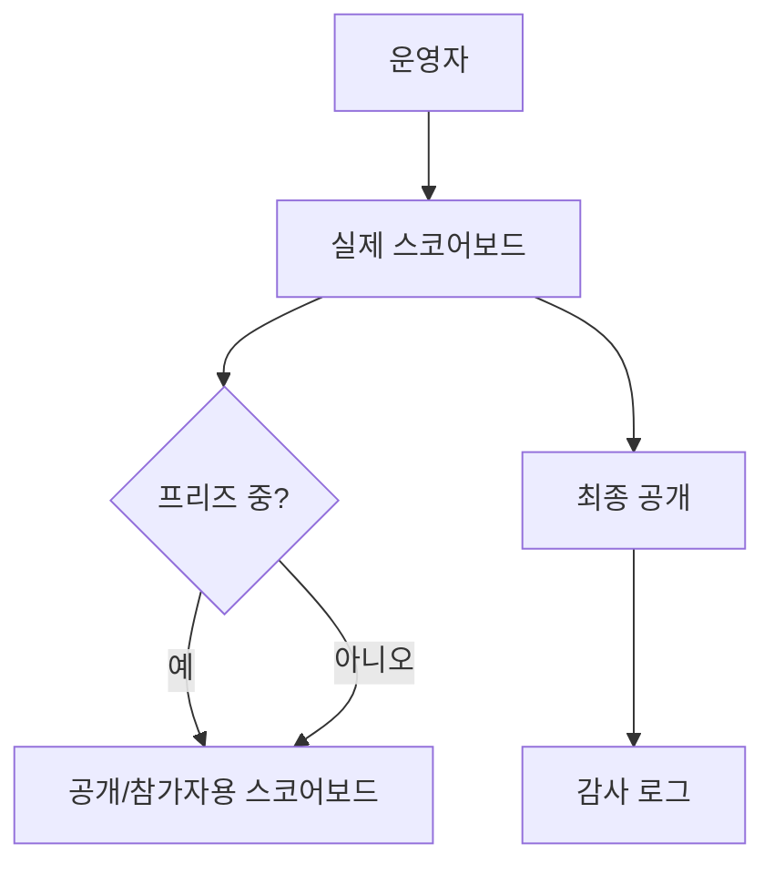
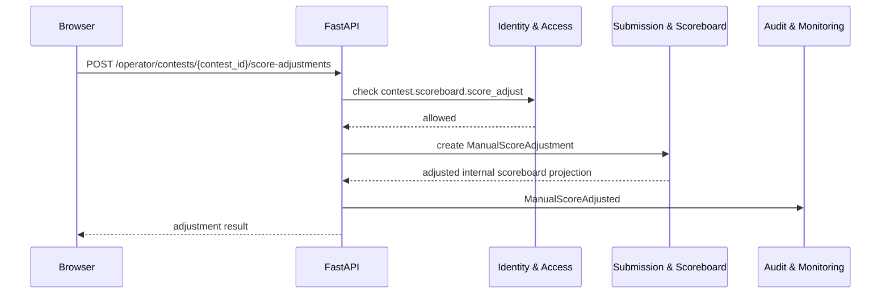

# 대회 운영자 페이지 DDD

## 범위

이 문서는 대회 운영자와 권한 있는 대회 운영매니저가 사용하는 특정 대회 운영 영역을 다룬다.
서비스 마스터/서비스 매니저의 전체 대회 생성/삭제 관리는 [서비스 관리자 대회 관리 페이지 DDD](./service-admin-contest-pages.md)를 기준으로 하고, 이 문서는 개별 대회의 실제 운영 화면을 기준으로 한다.

## 포함 페이지

- 대회 운영자 대시보드
- 관리자 인원 추가/수정/삭제 페이지
- 대회 참가 인원 추가/수정/삭제 페이지
- 대회 설정 페이지
- 문제 관리 페이지
- 테스트케이스/리소스 관리 페이지
- 공지사항/긴급 공지 운영 페이지
- 질문 게시판 운영 페이지
- 관리자용 채점 목록 페이지
- 관리자용 채점 결과 페이지
- 관리자용 스코어보드 페이지
- 종료 후 점수 개별 조정 페이지
- 재채점 검토/최종 결과 공개 페이지

## 페이지별 역할

| 페이지 | 주 목적 | 필요 권한 |
| --- | --- | --- |
| 운영자 대시보드 | 대회 상태, 참가 현황, 제출/큐/공지 상태 요약 | 대회 운영자 또는 권한 있는 운영매니저 |
| 관리자 인원 관리 | 대회 운영자/운영매니저 초대, 권한 수정, 제거 | `contest.operator.*`, `contest.manager.*` |
| 참가 인원 관리 | 참가 팀 등록, 로그인 식별자, 상태, 접속 정책 관리 | `contest.participant.*` |
| 대회 설정 | 일정, 공개 정책, 채점 제도, 점수 계산 정책, 스코어보드 정책 관리 | `contest.update_*`, `contest.participant_policy.*`, `contest.scoring_policy.*` |
| 문제 관리 | 문제 본문, 예제, 리소스, 테스트케이스, 배점 관리 | `contest.problem.*`, `contest.testcase.*`, `contest.generator.*` |
| 공지 운영 | 공지사항, 긴급 공지 작성/수정/게시 | `contest.notice.*` |
| 질문 운영 | 질문 조회, 답변, 공개/비공개 처리 | `contest.board.*` |
| 관리자용 채점 목록 | 모든 팀의 제출 상태와 코드 확인 | `contest.submission.view`, `contest.submission.source.view` |
| 관리자용 채점 결과 | 단일 제출의 판정, 코드, 메시지 확인 | `contest.submission.view` |
| 관리자용 스코어보드 | 실제 스코어보드, 프리즈/해제/최종 공개 관리 | `contest.scoreboard.*` |
| 종료 후 점수 조정 | 종료 후 팀/문제별 점수 수동 조정 | `contest.scoreboard.score_adjust` |
| 결과 확정 | 재채점 결과와 점수 조정 검토, 공식 결과 확정 | 스코어보드 권한 |

## Bounded Context 관계



## 운영자 메뉴 구조



## 운영 플로우



## 관리자 인원 관리

관리자 인원 관리는 참가 팀 관리와 분리한다.
대회 운영자/운영매니저는 같은 대회의 참가 팀으로 등록될 수 없으므로, 인원 추가 시 역할 충돌 검사가 필요하다.



필수 규칙:

- 대회 운영자는 해당 대회의 모든 권한을 가진 것으로 처리한다.
- 대회 운영매니저는 permission grant 범위 안에서만 메뉴와 API를 사용할 수 있다.
- 관리자 인원 변경은 감사 로그 대상이다.
- 같은 계정이 같은 대회의 운영자/운영매니저와 참가 팀을 동시에 가질 수 없다.

## 대회 참가 인원 관리



참가 인원 관리 원칙:

- 대회 참가 단위는 `n인 1팀`, `n >= 1`이다.
- 팀 이름, 팀장 이름/메일, 팀원 이름/메일을 등록한다.
- 참가자 로그인과 OTP, 세션은 참가자 이메일 단위로 관리한다.
- `invited`는 초대/등록 후 아직 최초 로그인하지 않은 상태다.
- 최초 로그인 성공 시 `active`로 전환한다.
- `disqualified` 팀의 스코어보드 표시 여부는 대회별 공개 정책으로 유지한다.

## 대회 설정 페이지



대회 설정에서 확정해야 하는 핵심값:

- 채점 제도: `AC/WA`, `점수제`
- 점수 계산 정책: 기본값 또는 대회별 override
- 점수 반영 방식: 기본값은 채점 완료 후 즉시 반영
- 점수제 동점 처리: 기본값은 `submitted_at` 기준
- 기본 동점 처리 기준까지 모두 같은 경우 중복 순위 허용
- 중복 순위 허용 여부
- 실격 팀 스코어보드 표시 정책
- 문제/테스트케이스 진행 중 수정 가능 범위
- 참가자 이메일별 세션 정책

점수 계산 정책 기본값:

- 점수제 대회는 모든 문제를 최대 `100점`으로 검증한다.
- 일반문제는 `0점 또는 100점`만 나온다.
- 서브태스크형 문제는 기준별 연결 테스트케이스가 모두 정답일 때 해당 기준 점수를 얻는다.
- 테스트케이스 진행 중 오답이 나오면 이후 테스트케이스를 진행하지 않고 즉시 오답으로 확정한다.
- 총점은 문제별 최고 점수 합산으로 계산한다.
- 동점 처리는 해당 총점 도달에 기여한 제출의 `submitted_at`을 기본 기준으로 한다.

## 관리자용 제출/채점 결과

운영자는 모든 팀의 제출 현황과 제출 소스코드를 볼 수 있어야 한다.
이 기능은 공정성 검토와 생성형 AI 또는 외부 자동화 도구 사용 의심 사례 확인 목적을 가진다.



## 관리자용 스코어보드



스코어보드 원칙:

- 운영자 화면은 프리즈 중에도 실제 스코어보드를 볼 수 있다.
- 참가자와 공개 사용자는 프리즈 정책이 적용된 projection을 본다.
- 점수제 대회의 기본 정렬은 총점 내림차순, 동률 시 `submitted_at` 기준이다.
- 같은 총점과 같은 `submitted_at`까지 발생하면 경기력과 무관한 내부 키로 순위를 가르지 않고 중복 순위를 허용한다.
- 최종 공개는 명시적인 운영자 액션이어야 한다.

## 종료 후 점수 개별 조정

대회가 `ended` 상태가 된 뒤 관리자는 팀/문제별 점수를 개별 조정할 수 있다.
이 기능은 채점 데이터 오류, 운영 판단, 이의 제기 처리처럼 공식 결과 확정 전에 점수를 보정해야 하는 경우를 위한 것이다.



점수 조정 원칙:

- 점수 조정은 `ended` 이후에만 허용한다.
- `finalized` 이후 조정은 기본적으로 금지하고, 필요하면 별도 재오픈 절차를 둔다.
- 조정 단위는 참가 팀과 문제를 기준으로 한다.
- 조정 값은 변경 전 점수, 변경 후 점수, 조정 사유, 작업자를 기록해야 한다.
- 수동 조정은 대회 당시 스코어보드를 자동 변경하지 않고, 최종 공개 전 내부 스코어보드 projection에만 반영한다.
- 최종 스코어보드에 반영하려면 운영자가 별도 확정 액션을 수행해야 한다.

## API 초안

```text
GET /operator/contests/{contest_id}/dashboard

GET /operator/contests/{contest_id}/settings
PATCH /operator/contests/{contest_id}/settings/basic
PATCH /operator/contests/{contest_id}/settings/schedule
PATCH /operator/contests/{contest_id}/settings/visibility
PATCH /operator/contests/{contest_id}/settings/participant-policy
PATCH /operator/contests/{contest_id}/settings/scoring-policy
PATCH /operator/contests/{contest_id}/settings/score-calculation-policy
PATCH /operator/contests/{contest_id}/settings/scoreboard-policy

GET /operator/contests/{contest_id}/staff
POST /operator/contests/{contest_id}/operators
POST /operator/contests/{contest_id}/managers
PATCH /operator/contests/{contest_id}/managers/{manager_id}/permissions
DELETE /operator/contests/{contest_id}/managers/{manager_id}

GET /operator/contests/{contest_id}/participants
POST /operator/contests/{contest_id}/participants
PATCH /operator/contests/{contest_id}/participants/{participant_team_id}
DELETE /operator/contests/{contest_id}/participants/{participant_team_id}

GET /operator/contests/{contest_id}/problems
POST /operator/contests/{contest_id}/problems
PATCH /operator/contests/{contest_id}/problems/{problem_id}
DELETE /operator/contests/{contest_id}/problems/{problem_id}

GET /operator/contests/{contest_id}/submissions
GET /operator/contests/{contest_id}/submissions/{submission_id}
GET /operator/contests/{contest_id}/submissions/{submission_id}/source

GET /operator/contests/{contest_id}/scoreboard/internal
GET /operator/contests/{contest_id}/scoreboard/public-preview
POST /operator/contests/{contest_id}/score-adjustments
GET /operator/contests/{contest_id}/score-adjustments
POST /operator/contests/{contest_id}/scoreboard/freeze
POST /operator/contests/{contest_id}/scoreboard/unfreeze
POST /operator/contests/{contest_id}/scoreboard/finalize
```

## 권한과 감사 로그

감사 로그 필수 대상:

- 대회 설정 변경
- 운영자/운영매니저 추가, 권한 변경, 제거
- 참가 팀 추가, 상태 변경, 삭제
- 문제 본문, 테스트케이스, 배점 정책 변경
- 제출 소스코드 열람
- 종료 후 점수 개별 조정
- 스코어보드 프리즈/해제/최종 공개

권한 체크 원칙:

- 화면 메뉴 노출과 API 권한 검사는 같은 permission source를 사용한다.
- 대회 운영자는 담당 대회 안에서 full access로 처리한다.
- 대회 운영매니저는 `contest.*` permission과 scope로 제한한다.
- 서비스 마스터는 개별 대회 운영 영역에 직접 진입할 수 있다.
- 서비스 매니저는 부여받은 permission과 scope가 허용하는 대회 운영 영역에만 직접 진입할 수 있다.

## 남은 결정 사항

- 공지/질문 게시판 관리 permission은 `contest.notice.*`, `contest.board.*` 기준으로 더 세분화할 수 있다.
