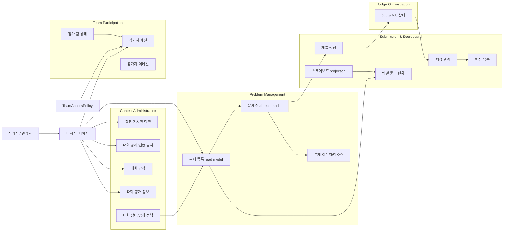
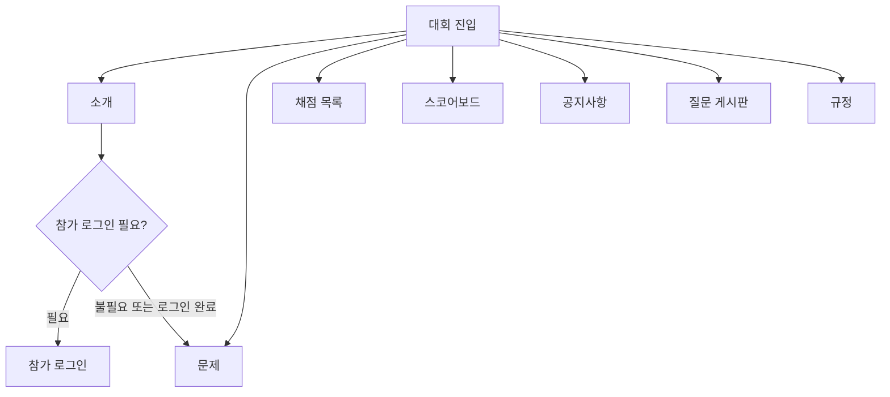
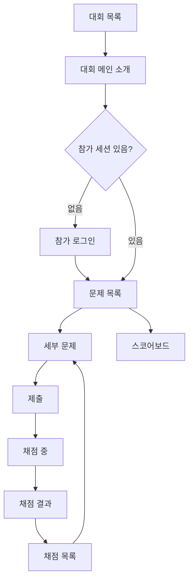
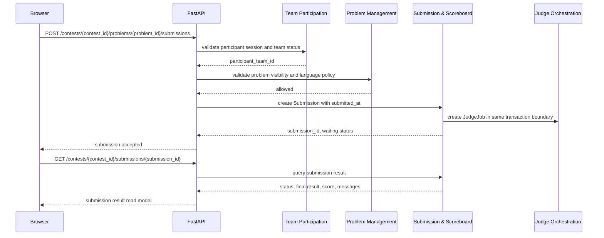
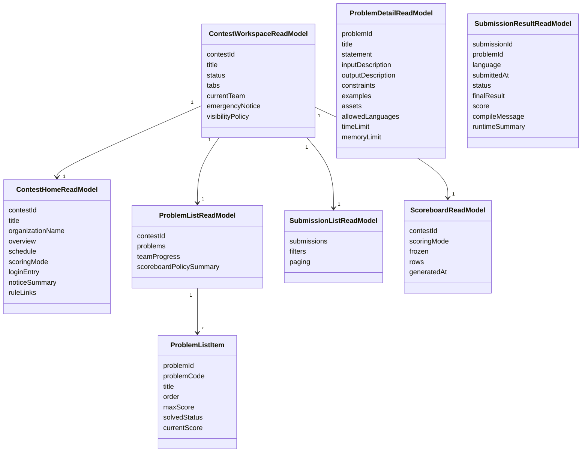

# 대회 참가자 페이지 DDD

## 범위

이 문서는 특정 대회에 진입한 참가자와 관람자가 사용하는 대회 내부 페이지를 다룬다.
대회 목록에서 특정 대회를 선택한 뒤, 대회 소개, 문제, 제출, 채점 결과, 스코어보드로 이어지는 화면 흐름을 기준으로 한다.

운영자 전용 관리 화면은 [대회 운영자 페이지 DDD](./contest-operator-pages.md)에서 다룬다.

## 포함 페이지

- 대회 탭 페이지
- 각 대회별 메인 소개 페이지
- 문제 목록 페이지
- 세부 문제 페이지
- 제출 페이지
- 채점 목록 페이지
- 채점 결과 페이지
- 스코어보드 페이지
- 대회 공지사항/긴급 공지 노출 영역
- 질문 게시판 진입 영역

## 페이지별 역할

| 페이지 | 주 목적 | 주요 사용자 | 소유 도메인 |
| --- | --- | --- | --- |
| 대회 탭 페이지 | 대회 내부 주요 화면 간 이동 | 참가자, 관람자 | Contest Page Composition |
| 대회 메인 소개 | 개요, 일정, 규정, 공지, 참가 로그인 진입 제공 | 참가자, 관람자 | Contest Administration |
| 문제 목록 | 참가 가능한 문제 목록과 풀이 상태 제공 | 참가 팀 | Problem Management, Submission & Scoreboard |
| 세부 문제 | 문제 본문, 제한, 예제, 제출 진입 제공 | 참가 팀 | Problem Management |
| 제출 페이지 | 소스코드 제출 생성 | 참가 팀 | Submission & Scoreboard |
| 채점 목록 | 내 팀 제출 목록과 상태 조회 | 참가 팀 | Submission & Scoreboard |
| 채점 결과 | 단일 제출의 판정, 메시지, 점수 조회 | 참가 팀 | Submission & Scoreboard, Judge Orchestration |
| 스코어보드 | 대회 정책에 맞는 순위 조회 | 참가자, 관람자, 운영자 | Submission & Scoreboard |

## Bounded Context 관계



## 대회 탭 구조



탭 노출 원칙:

- 대회 상태와 공개 정책에 따라 탭의 표시 여부와 접근 가능 여부가 달라진다.
- 문제, 제출, 내 채점 목록은 참가 팀 세션이 필요하다.
- 스코어보드는 대회 공개 정책과 프리즈 정책을 따른다.
- 공지사항, 규정, 소개는 비로그인 사용자도 볼 수 있는 공개 영역으로 둘 수 있다.

## 참가자 플로우



## 제출과 채점 결과 흐름



## Read Model



## API 초안

```text
GET /contests/{contest_id}/workspace
GET /contests/{contest_id}/home
GET /contests/{contest_id}/problems
GET /contests/{contest_id}/problems/{problem_id}
POST /contests/{contest_id}/problems/{problem_id}/submissions
GET /contests/{contest_id}/submissions
GET /contests/{contest_id}/submissions/{submission_id}
GET /contests/{contest_id}/scoreboard
GET /contests/{contest_id}/notices
GET /contests/{contest_id}/boards
```

## 접근 규칙

- 비로그인 사용자는 대회 소개, 공개 공지, 규정, 공개 스코어보드만 접근할 수 있다.
- 참가 팀 세션이 있어야 문제 목록, 문제 상세, 제출, 내 채점 목록에 접근할 수 있다.
- `invited` 상태 팀은 최초 로그인 성공 시 `active`로 전환한 뒤 참가 화면을 사용한다.
- `disqualified`, `disabled` 팀은 문제 조회와 제출이 불가능하다.
- 스코어보드는 대회별 공개 정책, 프리즈 정책, 중복 순위 허용 정책을 따른다.
- 점수제 대회의 기본 동점 처리는 `submitted_at` 기준 read model로 제공한다.
- 같은 총점과 같은 `submitted_at`까지 발생하면 중복 순위를 허용한다.

## 구현 메모

- 대회 탭 페이지는 여러 컨텍스트의 read model을 조합하는 shell로 본다.
- 참가자 화면은 운영자용 실제 스코어보드와 공개/참가자용 스코어보드를 구분해야 한다.
- 문제 본문과 공지/질문 본문은 Markdown subset, LaTeX 입력, KaTeX 렌더링, 이미지 asset 참조 정책을 따라야 한다.
- 제출 결과는 `waiting`, `preparing`, `judging` 같은 진행 상태와 최종 판정 결과를 분리해 표시해야 한다.
