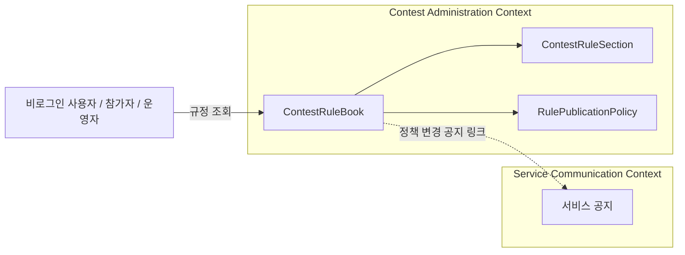
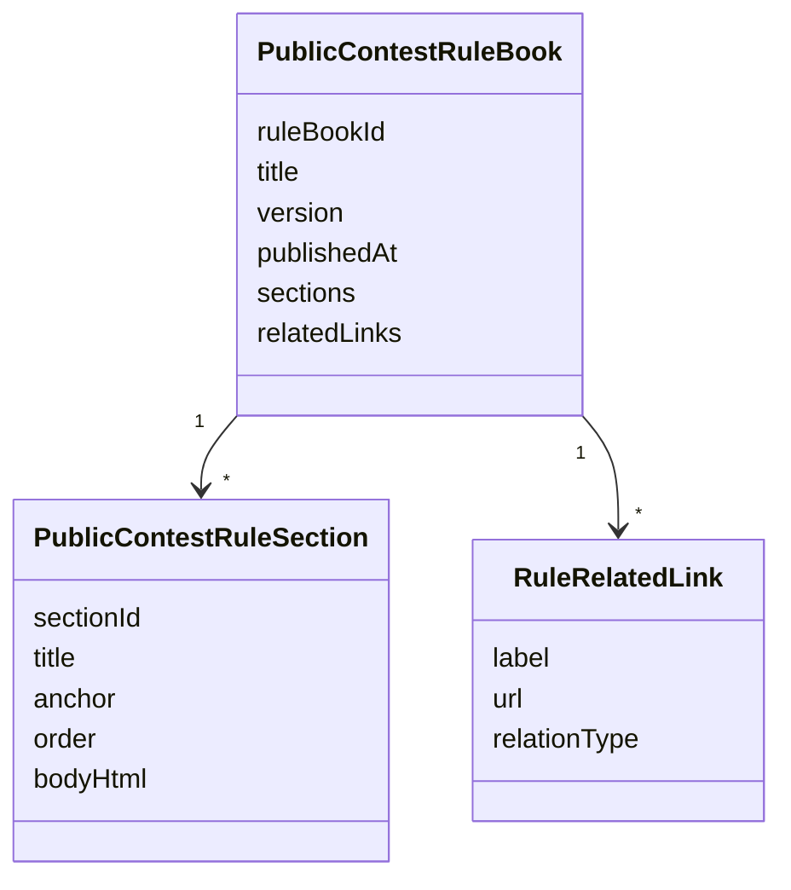
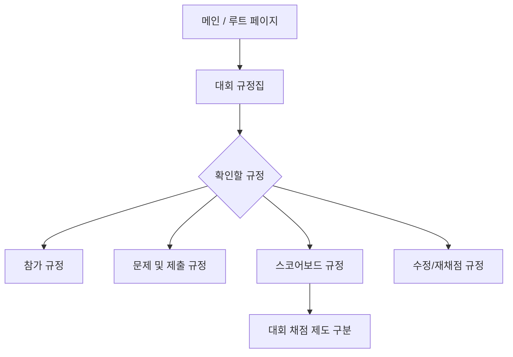
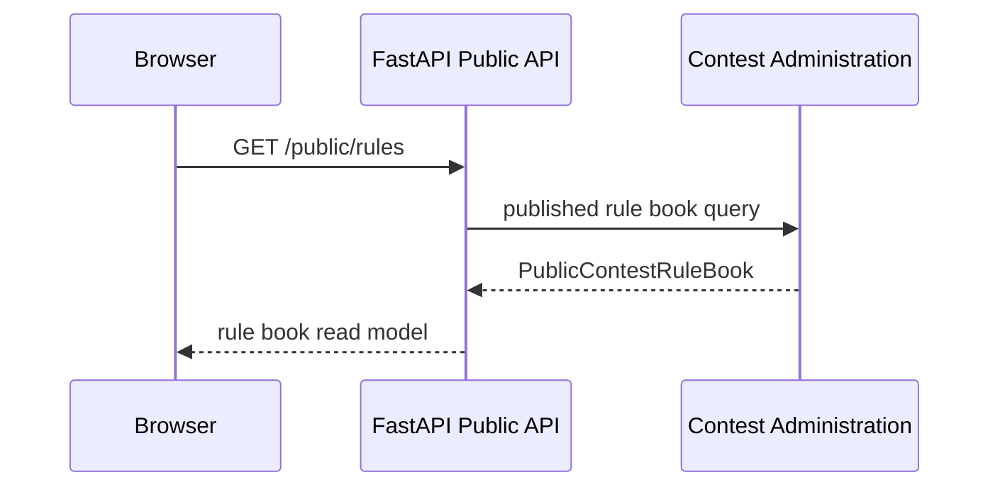

# 대회 규정집 페이지 DDD

## 범위

이 문서는 공통 대회 규정집 페이지를 다룬다.
대회 규정집은 참가 규정, 문제/제출 규정, 스코어보드 규정, 수정/재채점 규정을 공개적으로 안내한다.

## 포함 페이지

- 대회 규정집 목록/목차 페이지
- 대회 규정집 상세 페이지
- 규정 섹션 앵커 이동
- 관련 대회 채점 제도 문서 링크

## 소유 컨텍스트



## 페이지 책임

| 페이지 | 목적 | 접근 권한 | 주요 데이터 |
| --- | --- | --- | --- |
| 규정집 목차 | 규정 섹션 탐색 | 공개 | 참가, 제출, 스코어보드, 수정 규정 |
| 규정집 상세 | 규정 원문 확인 | 공개 | Markdown 본문, 섹션 앵커, 관련 문서 링크 |
| 섹션 앵커 | 특정 규정으로 직접 이동 | 공개 | 섹션 ID, 제목 |

## Aggregate / Read Model



## 사용자 플로우



## API 흐름



## API 초안

```text
GET /public/rules
GET /public/rules/{section_anchor}
```

운영에서 규정집을 CMS처럼 관리할 경우 추후 아래 API를 검토한다.

```text
GET /admin/rules
PATCH /admin/rules
POST /admin/rules/publish
```

## 공개 원칙

- 규정집은 비로그인 사용자도 조회할 수 있다.
- 규정 변경 이력은 추후 버전 관리가 필요하다.
- 규정 변경은 서비스 공지 또는 대회 공지로 안내할 수 있어야 한다.
- Markdown 원본을 안전하게 렌더링하고 HTML 직접 입력은 허용하지 않는다.
- 규정집 페이지는 참가자 로그인과 운영자 로그인을 혼동시키지 않아야 한다.

## Domain Event 후보

운영 관리 기능을 만들 경우 아래 이벤트를 사용할 수 있다.

- `ContestRuleBookUpdated`
- `ContestRuleBookPublished`
- `ContestRuleBookVersionCreated`

## 구현 메모

- 현재 규정은 문서 기반 정적 read model로 시작해도 된다.
- 향후 운영자가 UI에서 규정을 수정해야 하면 `ContestRuleBook` aggregate로 승격한다.
- 섹션 앵커는 URL 공유가 가능하도록 안정적인 slug를 사용한다.
