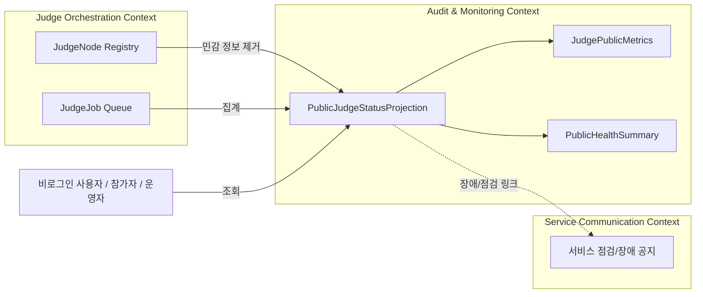
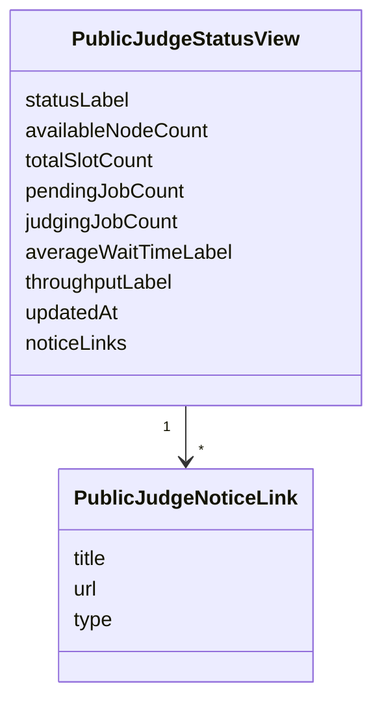
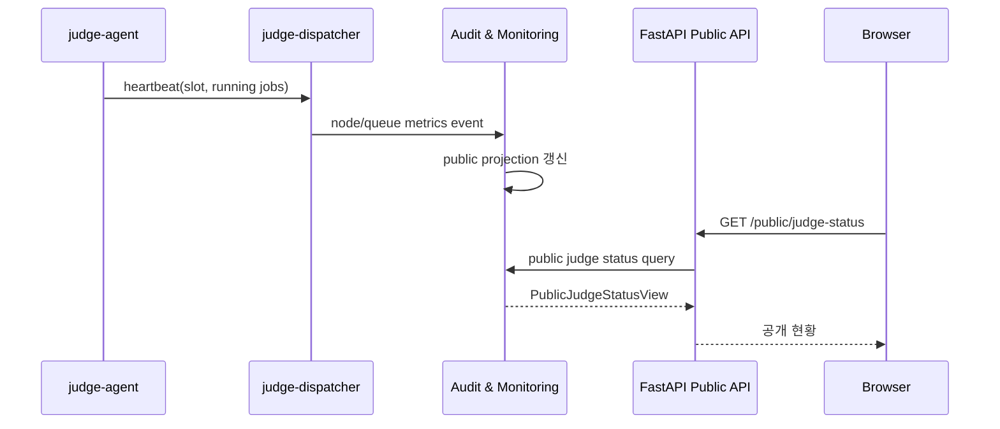
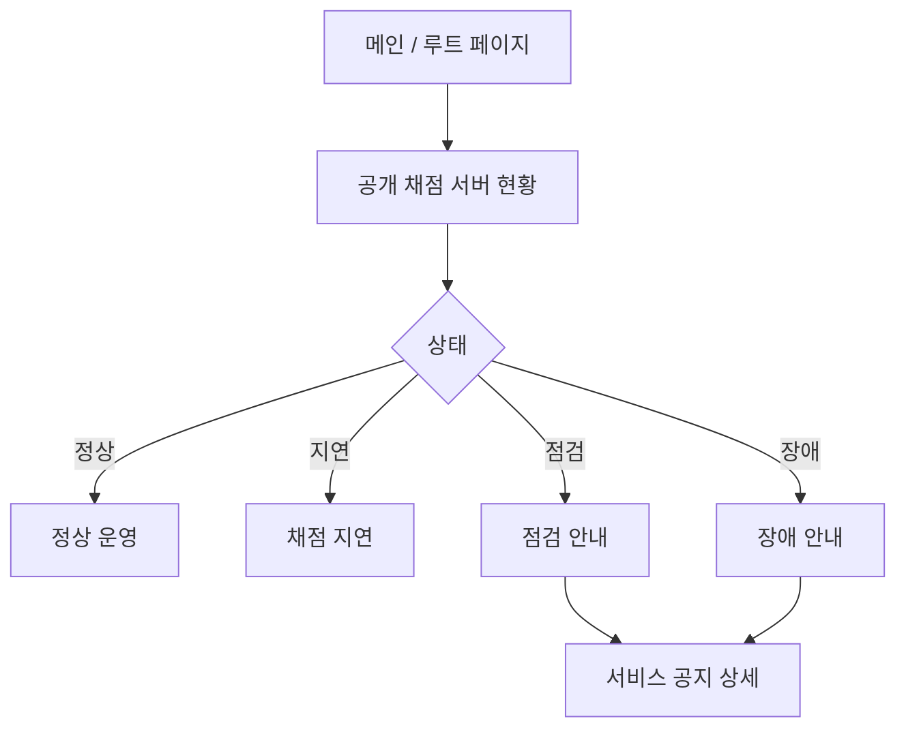

# 공개 채점 서버 현황 페이지 DDD

## 범위

이 문서는 비로그인 사용자도 볼 수 있는 공개 채점 서버 현황 페이지를 다룬다.
목적은 서비스가 정상 운영 중인지, 채점 대기열이 어느 정도인지 공개 가능한 범위에서 보여주는 것이다.
내부 운영용 서버 상세 정보와 공개 현황은 분리한다.

## 포함 페이지

- 공개 채점 서버 현황 페이지
- 공개 큐 상태 요약
- 공개 채점 처리량 요약
- 장애 또는 점검 안내 링크

## 소유 컨텍스트



## 공개/비공개 데이터 경계

| 항목 | 공개 여부 | 설명 |
| --- | --- | --- |
| 전체 상태 라벨 | 공개 | 정상, 지연, 점검, 장애 |
| 사용 가능 채점 노드 수 | 공개 가능 | 세부 노드명 없이 숫자만 |
| 전체 채점 slot 수 | 공개 가능 | 운영 정책에 따라 숫자만 |
| 대기 중 job 수 | 공개 가능 | 큐 길이 요약 |
| 최근 처리량 | 공개 가능 | 분/시간 단위 집계 |
| 평균 대기 시간 | 공개 가능 | 대략적인 범위 또는 집계 |
| 서버별 IP | 비공개 | 내부망 정보 |
| Tailscale 식별자 | 비공개 | 내부 네트워크 정보 |
| 서버별 작업 할당 | 비공개 | 운영 상세 정보 |
| 제출별 queue 위치 | 기본 비공개 | 참가자별 제출 화면에서 별도 처리 |
| 장애 노드 상세 원인 | 비공개 | 운영 대시보드에서만 조회 |

## Read Model



## 상태 산출 흐름



## 사용자 플로우



## 상태 라벨 기준

```text
normal: 사용 가능한 judge node가 있고 큐 지연이 기준 이하
delayed: 사용 가능한 judge node는 있지만 pending job 또는 평균 대기 시간이 기준 초과
maintenance: 운영자가 점검 상태로 표시
incident: 사용 가능한 judge node가 없거나 dispatcher/queue 이상
unknown: 최신 projection 갱신 시각이 오래됨
```

구체적인 threshold는 운영 경험에 따라 조정한다.
공개 페이지에는 threshold 숫자를 반드시 노출할 필요는 없다.

## API 초안

```text
GET /public/judge-status
```

운영 상세 API는 공개 API와 분리한다.

```text
GET /admin/judge/nodes
GET /admin/judge/queue
GET /admin/judge/metrics
```

## 보안 원칙

- 공개 API는 내부 IP, hostname, Tailscale 이름, 서버별 상세 job 할당을 반환하지 않는다.
- 장애 원인 상세와 node별 heartbeat는 운영자 API에서만 제공한다.
- 공개 현황은 집계 projection을 사용하고, 실시간 내부 상태 테이블을 그대로 노출하지 않는다.
- 오래된 projection은 `unknown` 또는 `정보 갱신 지연` 상태로 표시한다.
- 공개 현황 API에는 rate limit을 적용한다.

## Domain Event 후보

- `JudgeNodeHeartbeatReceived`
- `JudgeNodeMarkedUnavailable`
- `JudgeQueueMetricsUpdated`
- `PublicJudgeStatusProjectionUpdated`
- `JudgeIncidentDetected`
- `JudgeMaintenanceModeChanged`

## 구현 메모

- 공개 현황은 Redis 또는 DB에 materialized projection으로 저장할 수 있다.
- 화면은 주기적으로 polling하거나 추후 SSE/WebSocket으로 갱신할 수 있다.
- 공개 현황 페이지는 운영 대시보드가 아니므로 상세 디버깅 정보를 보여주지 않는다.
- 점검/장애 상태는 서비스 공지 게시판의 관련 공지와 연결할 수 있다.
