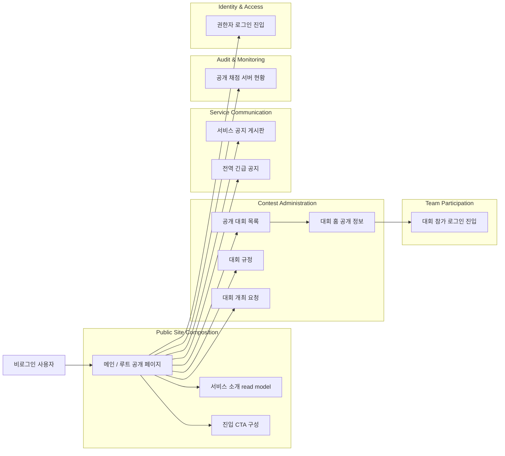
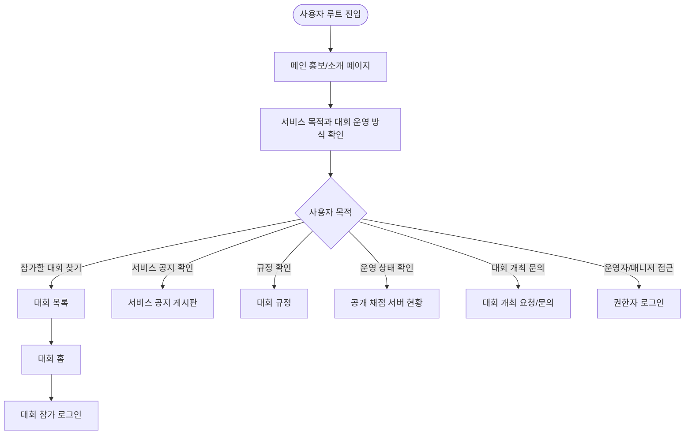
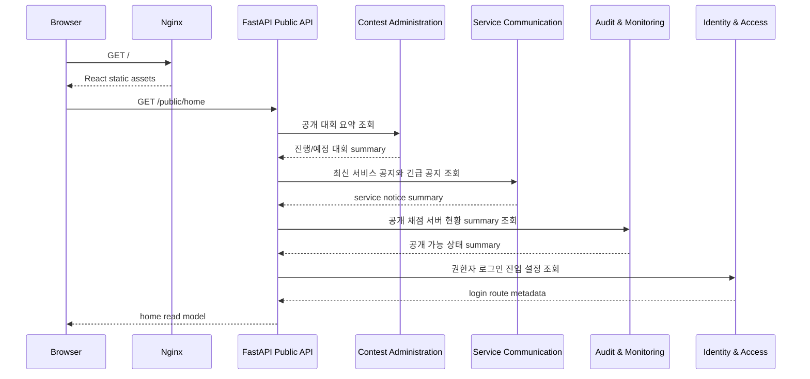
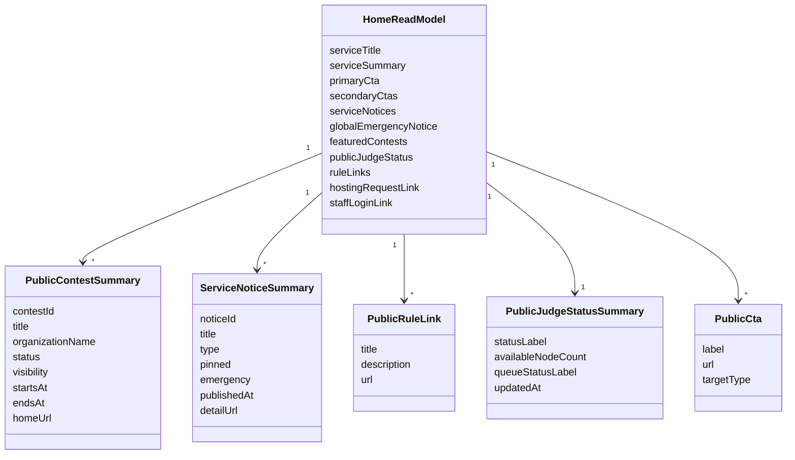
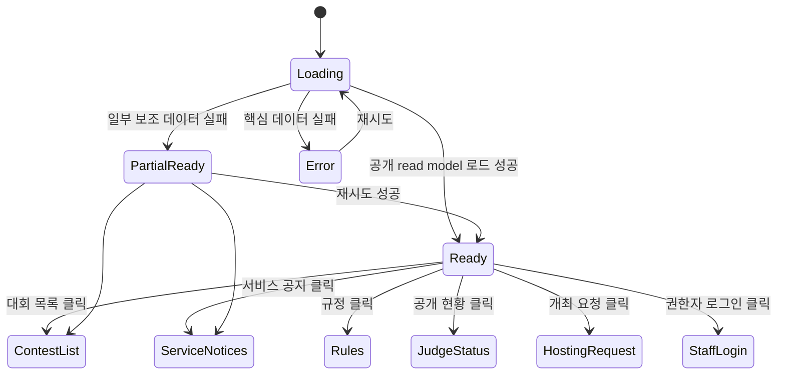

# 메인 / 루트 공개 페이지 DDD

## 범위

이 문서는 로그인 전 사용자가 처음 만나는 루트 공개 영역을 다룬다.
목적은 서비스 소개, 대회 규정 안내, 대회 탐색, 공개 운영 상태 확인, 참가/운영 진입점을 명확히 분리하는 것이다.

## 포함 페이지

- 메인 홍보/소개 페이지
- 서비스 공지 게시판 페이지
- 대회 규정 페이지
- 대회 목록 페이지
- 공개 채점 서버 현황 페이지
- 대회 개최 요청/문의 페이지
- 권한자 로그인 진입 페이지
- 대회 홈 진입 링크

메인 페이지에서 직접 모든 기능을 처리하지 않고, 각 도메인으로 가는 공개 read model을 조합해 보여주는 방식으로 본다.

## 페이지별 역할

| 페이지 | 주 목적 | 주요 사용자 | 소유 도메인 |
| --- | --- | --- | --- |
| 메인 홍보/소개 | 서비스 소개와 핵심 CTA 제공 | 비로그인 사용자, 참가자, 운영자 | Public Site Composition |
| 서비스 공지 게시판 | 관리자가 작성한 서비스 단위 공지 제공 | 비로그인 사용자, 참가자, 운영자 | Service Communication |
| 대회 규정 | 공통 참가/제출/스코어보드 규정 안내 | 참가자, 운영자 | Contest Administration |
| 대회 목록 | 진행/예정/종료 대회 탐색 | 참가자, 관람자 | Contest Administration |
| 공개 채점 서버 현황 | 공개 가능한 인프라 상태 확인 | 참가자, 관람자, 운영자 | Audit & Monitoring |
| 대회 개최 요청/문의 | 신규 대회 운영 문의 접수 | 주최자, 운영자 | Contest Administration |
| 권한자 로그인 진입 | 참가자 로그인과 운영자 로그인을 분리 | 운영자, 매니저 | Identity & Access |
| 대회 홈 링크 | 특정 대회 공개 홈으로 이동 | 참가자, 관람자 | Contest Administration |

## 필요한 추가 페이지

현재 메인/대회 규정/대회 목록 외에 아래 페이지가 필요하다.

- `공개 채점 서버 현황`: 메인 문서에 링크가 이미 언급되어 있으므로 별도 공개 페이지가 필요하다.
- `서비스 공지 게시판`: 관리자가 서비스 점검, 장애, 정책 변경, 기능 변경, 대회 개최 안내 같은 전역 공지를 게시한다.
- `대회 개최 요청/문의`: 대회 생성 요청 방법을 안내하거나 신청을 접수하는 페이지가 필요하다.
- `권한자 로그인`: 참가자 대회 로그인과 운영자/매니저 로그인을 혼동하지 않게 별도 진입점을 둔다.
- `대회 홈`: 대회 목록에서 선택한 뒤 개요, 공지, 규정, 참가 로그인으로 이어지는 공개 상세 페이지다.

## Bounded Context 관계



## 사용자 플로우



## 페이지 조합 흐름

루트 공개 페이지는 여러 컨텍스트의 데이터를 직접 소유하지 않는다.
각 컨텍스트가 공개 가능한 read model을 제공하고, 루트 페이지는 이를 조합한다.



## 공개 Read Model



## 공개 API 초안

```text
GET /public/home
GET /public/service-notices
GET /public/service-notices/{notice_id}
GET /public/rules
GET /public/contests
GET /public/contests/{contest_id}
GET /public/judge-status
POST /public/hosting-requests
```

API 원칙:

- 공개 API는 권한이 없어도 볼 수 있는 데이터만 반환한다.
- 공개 대회 목록은 대회 visibility policy를 반드시 적용한다.
- 서비스 공지 게시판은 공개 범위와 공개 종료 시각을 적용한다.
- 공개 채점 서버 현황은 내부 IP, Tailscale 식별자, 서버별 상세 할당 정보를 반환하지 않는다.
- 권한자 로그인 진입점과 참가자 로그인 진입점은 URL과 화면 문구에서 명확히 분리한다.
- 대회 개최 요청은 스팸 방지 rate limit과 감사성 이벤트 기록 대상이다.

## UI 상태



## 도메인 이벤트 후보

루트 공개 페이지 자체가 도메인 이벤트를 많이 만들 필요는 없다.
다만 아래 이벤트는 분석, 운영 추적, 스팸 방지를 위해 남길 수 있다.

- `PublicHomeViewed`
- `PublicServiceNoticeViewed`
- `PublicServiceNoticeDetailOpened`
- `PublicContestListViewed`
- `PublicContestHomeOpened`
- `PublicRulesViewed`
- `PublicJudgeStatusViewed`
- `HostingRequestSubmitted`
- `StaffLoginEntryOpened`

## 구현 메모

- 메인 페이지는 마케팅 페이지처럼 보이더라도 도메인 데이터 소유자가 아니다.
- 대회 목록과 대회 홈은 `Contest Administration`의 공개 read model을 사용한다.
- 서비스 공지 게시판은 `Service Communication`의 공개 read model을 사용한다.
- 공개 채점 서버 현황은 `Audit & Monitoring`의 공개 projection을 사용한다.
- 운영자 로그인은 `Identity & Access`, 참가 로그인은 `Team Participation`으로 진입한다.
- 루트 페이지에서 참가자 로그인 폼을 직접 제공하지 않고, 특정 대회 홈을 거쳐 참가 로그인으로 이동시키는 것이 안전하다.
