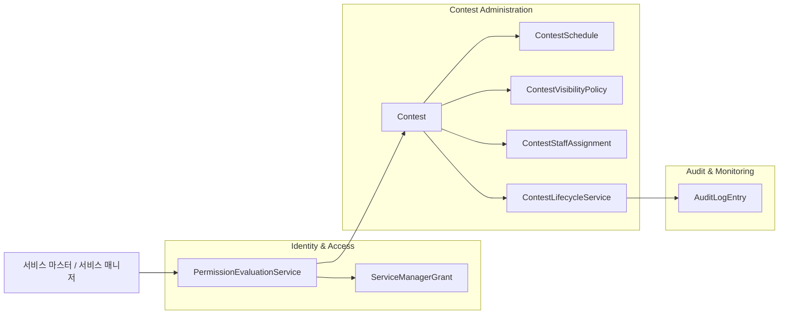
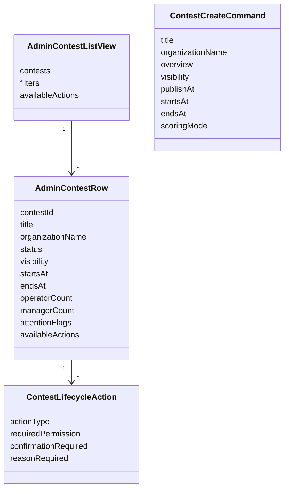
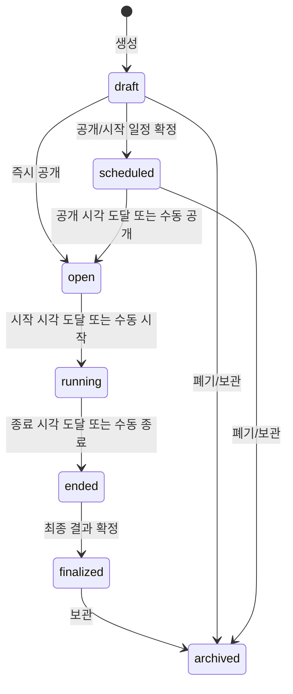
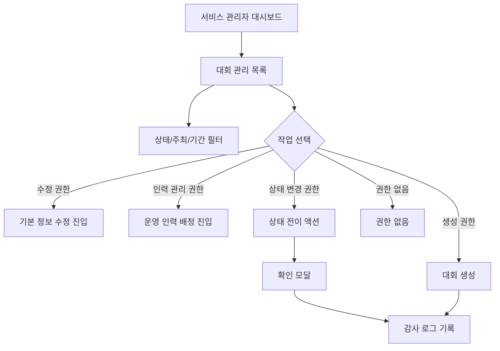
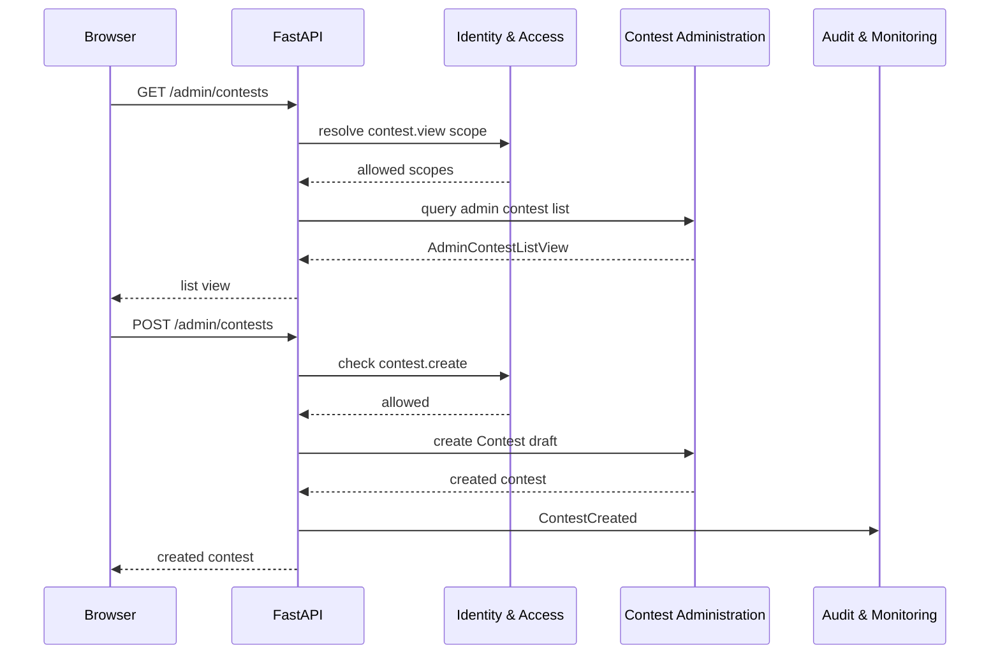

# 서비스 관리자 대회 관리 페이지 DDD

## 범위

이 문서는 서비스 관리자 영역의 대회 생성/목록/상태 전이/삭제 또는 보관 페이지를 다룬다.
서비스 마스터와 권한 있는 서비스 매니저가 대회 lifecycle을 관리하는 화면이다.
문제, 참가자, 제출, 스코어보드의 상세 운영은 이 문서가 아니라 대회 운영자 영역에서 다룬다.

## 포함 페이지

- 대회 관리 목록
- 대회 생성 페이지/모달
- 대회 기본 정보 수정 진입
- 대회 공개/오픈/종료/확정/보관 액션
- 대회 삭제 또는 보관 확인 모달
- 대회 운영자/운영매니저 배정 진입

## 소유 컨텍스트



## 페이지별 책임

| 페이지 | 목적 | 필요 권한 | 주요 데이터 |
| --- | --- | --- | --- |
| 대회 관리 목록 | 전체/권한 범위 내 대회 조회 | `contest.view` 또는 서비스 마스터 | 대회명, 상태, 공개 여부, 일정, 주최 |
| 대회 생성 | 새 대회 초안 생성 | `contest.create` 또는 서비스 마스터 | 이름, 주최, 일정, 공개 정책 |
| 기본 정보 수정 진입 | 대회 설정 화면으로 이동 | 수정 관련 권한 | 기본 정보, 일정, 공개 정책 |
| 상태 전이 액션 | 공개/오픈/종료/확정/보관 | 상태별 권한 | 현재 상태, 가능한 전이 |
| 삭제/보관 확인 | 위험 작업 확인 | `contest.delete` 또는 서비스 마스터 | 영향 범위, 확인 문구 |
| 운영 인력 배정 진입 | 운영자/운영매니저 관리로 이동 | 운영 인력 관리 권한 | 현재 배정 인력 요약 |

## Aggregate / Read Model



## 상태 전이 모델



전이 원칙:

- 진행 중(`running`)에는 공정성에 영향을 주는 설정 변경을 제한한다.
- 종료 후(`ended`) 재채점 검토는 가능하지만 공식 결과 반영은 별도 확정이 필요하다.
- 삭제는 데이터 유실 위험이 크므로 기본 액션은 `archived` 전환을 우선한다.
- 실제 hard delete가 필요하면 서비스 마스터 전용 위험 작업으로 분리한다.

## 사용자 플로우



## API 흐름



## API 초안

```text
GET /admin/contests
POST /admin/contests
GET /admin/contests/{contest_id}
PATCH /admin/contests/{contest_id}
POST /admin/contests/{contest_id}/schedule
POST /admin/contests/{contest_id}/open
POST /admin/contests/{contest_id}/start
POST /admin/contests/{contest_id}/close
POST /admin/contests/{contest_id}/finalize
POST /admin/contests/{contest_id}/archive
DELETE /admin/contests/{contest_id}
```

운영 인력 관리 진입:

```text
GET /admin/contests/{contest_id}/staff
POST /admin/contests/{contest_id}/operators
POST /admin/contests/{contest_id}/managers
```

## 권한 매핑

| 작업 | 권한 |
| --- | --- |
| 목록 조회 | `contest.view` |
| 생성 | `contest.create` |
| 기본 정보 수정 | `contest.update_basic` |
| 일정 수정 | `contest.update_schedule` |
| 주최/개요 수정 | `contest.update_organization`, `contest.update_overview` |
| 공개 정책 수정 | `contest.update_visibility` |
| 공개/오픈 | `contest.open` |
| 종료 | `contest.close` |
| 삭제 | `contest.delete` |
| 운영자 초대/수정/삭제 | `contest.operator.invite`, `contest.operator.update`, `contest.operator.remove` |
| 운영매니저 초대/권한/삭제 | `contest.manager.invite`, `contest.manager.permission_update`, `contest.manager.remove` |

서비스 마스터는 모든 작업을 수행할 수 있다.
서비스 매니저는 permission grant와 scope가 허용하는 대회에 대해서만 작업할 수 있다.

## Command 후보

- `CreateContest`
- `UpdateContestBasicInfo`
- `UpdateContestSchedule`
- `UpdateContestVisibility`
- `ScheduleContest`
- `OpenContest`
- `StartContest`
- `CloseContest`
- `FinalizeContest`
- `ArchiveContest`
- `DeleteContest`
- `AssignContestOperator`
- `InviteContestManager`

## Domain Event 후보

- `ContestCreated`
- `ContestBasicInfoUpdated`
- `ContestScheduleUpdated`
- `ContestVisibilityUpdated`
- `ContestScheduled`
- `ContestOpened`
- `ContestStarted`
- `ContestClosed`
- `ContestFinalized`
- `ContestArchived`
- `ContestDeleted`
- `ContestOperatorAssigned`
- `ContestManagerInvited`
- `ContestManagerPermissionUpdated`

## 감사 로그 대상

- 대회 생성
- 대회 기본 정보/일정/공개 정책 변경
- 대회 공개/시작/종료/확정/보관
- 대회 삭제
- 운영자/운영매니저 배정과 권한 변경

## 구현 메모

- 대회 목록은 서비스 마스터와 서비스 매니저의 scope에 따라 서로 다른 결과를 반환한다.
- 상태 전이는 버튼 노출뿐 아니라 API에서 도메인 규칙으로 검증한다.
- 삭제보다 보관을 기본 UX로 두고, hard delete는 별도 확인과 감사 로그를 요구한다.
- 대회 상세 운영은 이 페이지에서 직접 처리하지 않고 대회 운영자 영역으로 이동시킨다.
- 서비스 마스터는 모든 대회의 운영자 영역으로 이동할 수 있고, 서비스 매니저는 permission과 scope가 허용하는 대회만 이동할 수 있다.
