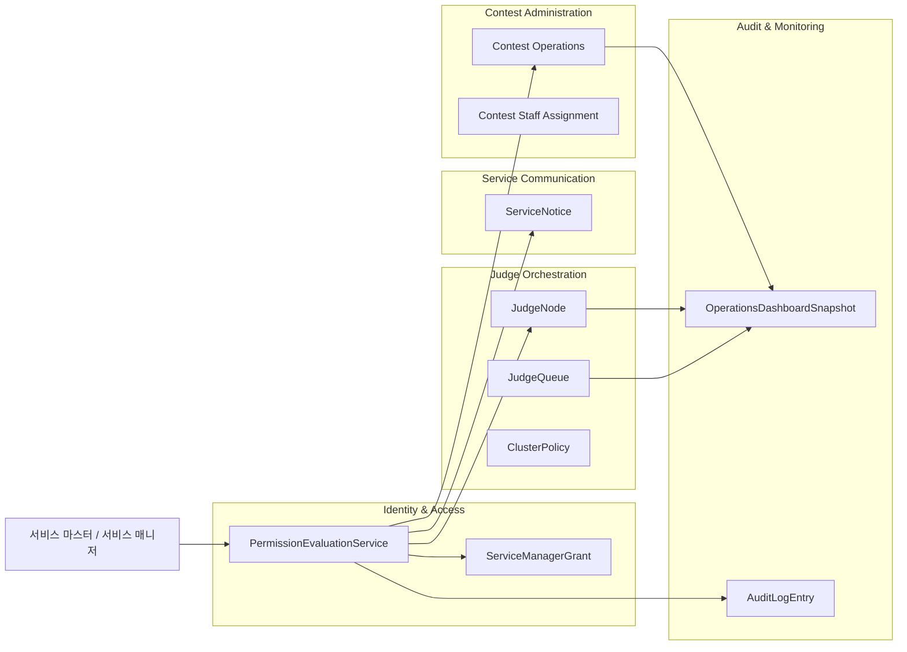
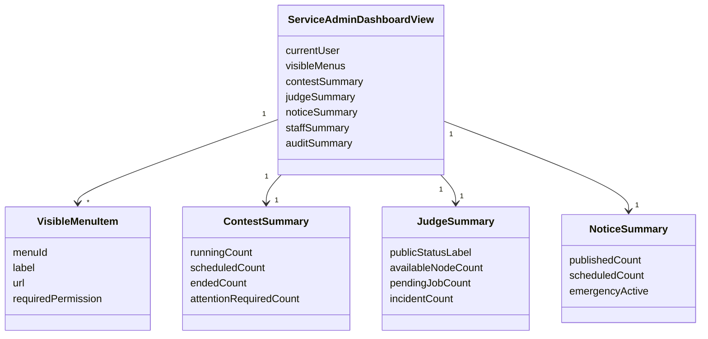
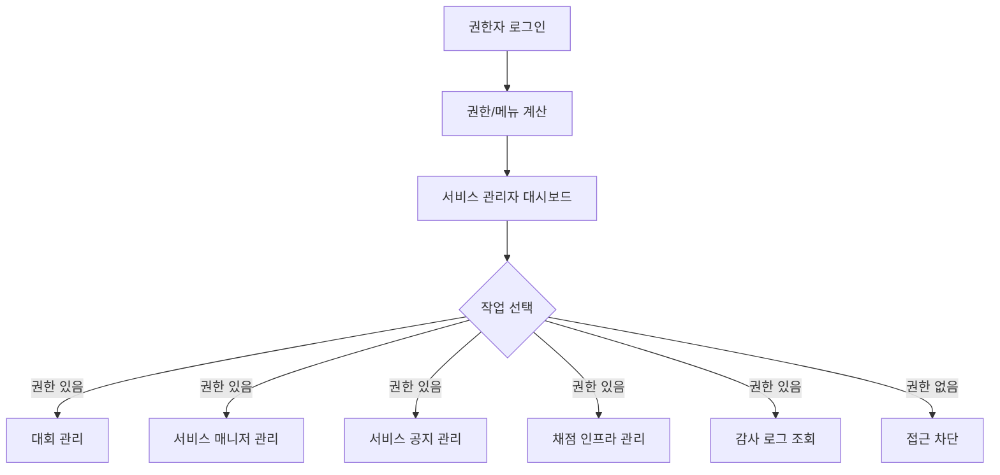
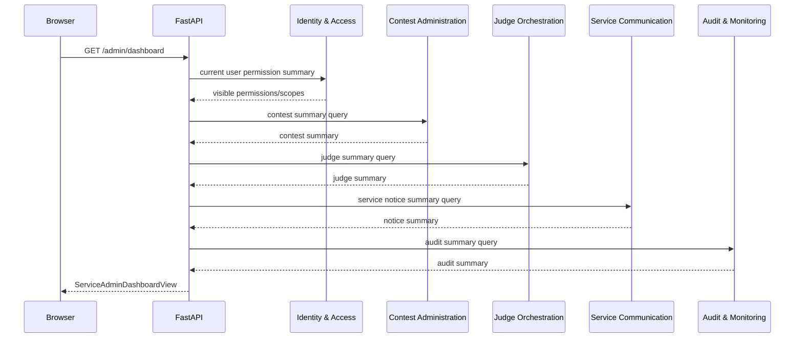

# 서비스 관리자 페이지 DDD

## 범위

이 문서는 서비스 마스터와 권한 있는 서비스 매니저가 사용하는 서비스 관리자 페이지를 다룬다.
서비스 관리자 페이지는 대회 생성/관리, 서비스 매니저 관리, 서비스 공지, 채점 인프라, 감사 로그를 조합하는 운영 영역이다.

## 포함 페이지

- 서비스 관리자 대시보드
- 대회 관리 목록
- 서비스 매니저 관리
- 서비스 공지 게시판 운영
- 채점 서버/클러스터 관리
- 메일 템플릿 관리
- 감사 로그 조회

## 소유 컨텍스트



## 메뉴 노출 원칙

| 메뉴 | 필요 권한 |
| --- | --- |
| 서비스 대시보드 | 서비스 마스터 또는 부여된 서비스 권한 |
| 대회 생성 | `contest.create` |
| 대회 오픈/종료/삭제 | `contest.open`, `contest.close`, `contest.delete` |
| 서비스 매니저 관리 | 서비스 마스터 또는 매니저 관리 권한 |
| 서비스 공지 관리 | `service.notice.manage` |
| 긴급 공지 노출 | `service.notice.emergency_publish` |
| 채점 큐 조회 | `judge.queue.view` |
| 채점 서버 조회 | `judge.server.view` |
| 채점 서버 scale/config | `judge.server.scale`, `judge.server.config_update` |
| 클러스터 정책 변경 | `judge.cluster.policy_update` |
| 감사 로그 조회 | `audit_log.view` |
| 메일 템플릿 관리 | `mail.template.view`, `mail.template.update` |

권한 없는 메뉴는 UI에서 숨기고 API에서도 반드시 차단한다.

## 대시보드 Read Model



## 사용자 플로우



## API 흐름



## API 초안

```text
GET /admin/dashboard
GET /admin/me/menus
GET /admin/contests
POST /admin/contests
GET /admin/service-managers
POST /admin/service-managers
PATCH /admin/service-managers/{manager_id}
GET /admin/audit-logs
```

연계 API:

```text
GET /admin/service-notices
GET /admin/judge/nodes
GET /admin/judge/queue
GET /admin/mail-templates
```

## 감사 로그 대상

- 대회 생성/오픈/종료/삭제
- 서비스 매니저 초대/권한 변경/삭제
- 서비스 공지 작성/수정/숨김/긴급 노출
- 채점 서버 scale/config 변경
- 클러스터 정책 변경
- 메일 템플릿 변경

## 보안 원칙

- 서비스 관리자 페이지는 권한자 JWT가 있어야 접근 가능하다.
- 모든 메뉴와 API는 서버 권한 검사 결과를 기준으로 한다.
- 서비스 마스터는 모든 검사 통과, 서비스 매니저는 grant된 permission만 허용한다.
- contest scoped 권한만 가진 계정은 서비스 전체 관리 메뉴에 접근할 수 없다.
- 민감 작업은 확인 절차와 감사 로그를 남긴다.

## 구현 메모

- 대시보드는 여러 컨텍스트의 projection을 조합하는 화면이며, 특정 도메인 규칙을 직접 소유하지 않는다.
- 운영 화면은 카드형 홍보 UI보다 상태 확인과 반복 작업에 적합한 밀도 높은 정보 구조가 필요하다.
- 메뉴는 프론트에서 하드코딩하지 말고 서버가 반환한 visible menu read model을 기준으로 렌더링한다.
