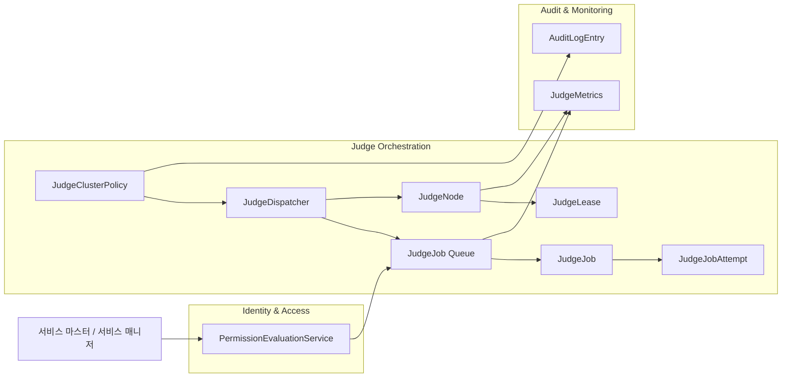
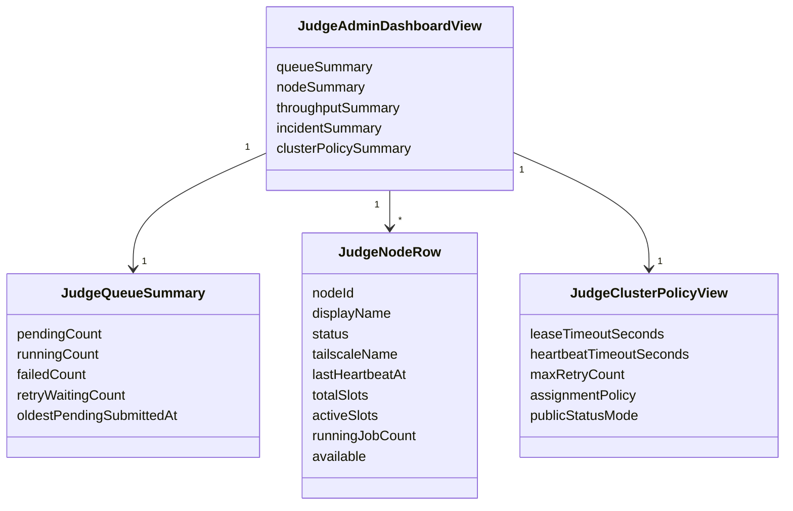
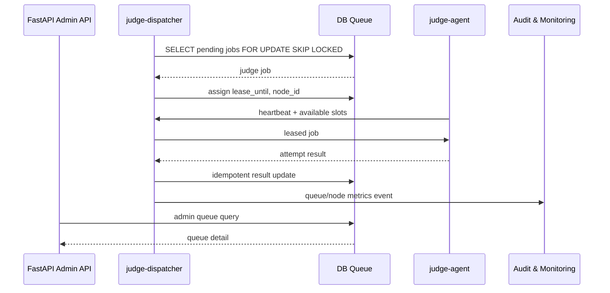
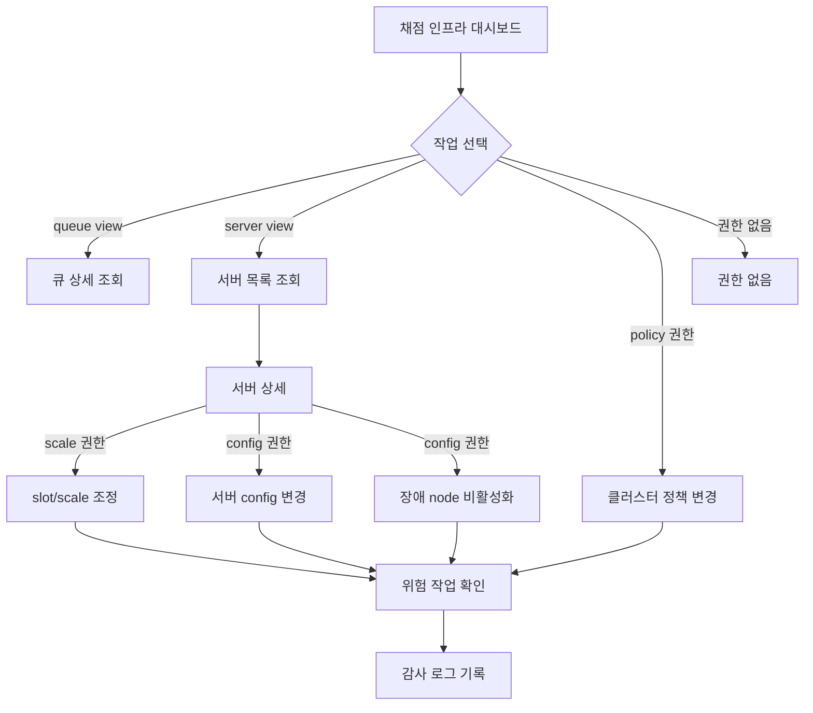
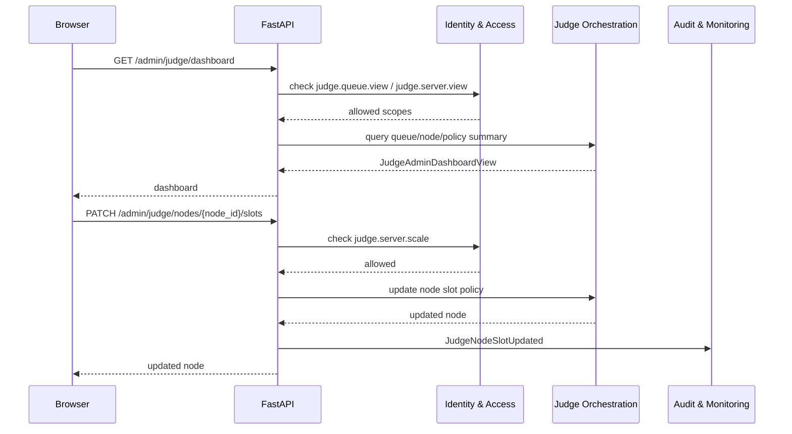

# 서비스 관리자 채점 인프라 페이지 DDD

## 범위

이 문서는 서비스 관리자 영역의 채점 큐, 채점 서버, slot/scale, 서버 설정, 클러스터 정책 관리 페이지를 다룬다.
공개 채점 서버 현황 페이지와 달리 운영자용 상세 정보와 제어 기능을 포함한다.

## 포함 페이지

- 채점 인프라 대시보드
- 채점 큐 상세 페이지
- 채점 서버 목록
- 채점 서버 상세
- slot/scale 설정 페이지 또는 모달
- 서버 config 변경 페이지 또는 모달
- 클러스터 정책 관리 페이지
- 장애 node 비활성화/복구 처리 모달

## 소유 컨텍스트



## 페이지별 책임

| 페이지 | 목적 | 필요 권한 | 주요 데이터 |
| --- | --- | --- | --- |
| 인프라 대시보드 | 큐/노드/처리량 전체 상태 조회 | `judge.queue.view` 또는 `judge.server.view` | 큐 길이, running job, node 상태 |
| 채점 큐 상세 | pending/running/failed job 조회 | `judge.queue.view` | job 상태, lease, attempt |
| 채점 서버 목록 | judge node 상태 조회 | `judge.server.view` | heartbeat, slot, 상태, 가용 여부 |
| 채점 서버 상세 | 특정 node의 작업/상태 확인 | `judge.server.view` | 최근 heartbeat, running attempts |
| slot/scale 설정 | 서버별 slot 또는 scale 조정 | `judge.server.scale` | 현재 slot, 목표 slot |
| 서버 config 변경 | judge server config 수정 | `judge.server.config_update` | 실행 제한, 언어 이미지, 정책 |
| 클러스터 정책 관리 | 전역 채점 정책 수정 | `judge.cluster.policy_update` | lease timeout, retry, assignment policy |
| 장애 node 처리 | node 비활성화/복구 | `judge.server.config_update` | node 상태, 비활성 사유 |

## 운영 Read Model



## 큐/lease 흐름



## 관리자 플로우



## API 흐름



## API 초안

조회:

```text
GET /admin/judge/dashboard
GET /admin/judge/queue
GET /admin/judge/jobs/{job_id}
GET /admin/judge/nodes
GET /admin/judge/nodes/{node_id}
GET /admin/judge/policy
GET /admin/judge/metrics
```

제어:

```text
PATCH /admin/judge/nodes/{node_id}/slots
PATCH /admin/judge/nodes/{node_id}/config
POST /admin/judge/nodes/{node_id}/disable
POST /admin/judge/nodes/{node_id}/enable
PATCH /admin/judge/policy
POST /admin/judge/jobs/{job_id}/retry
POST /admin/judge/jobs/{job_id}/cancel
```

## 권한 매핑

| 작업 | 권한 |
| --- | --- |
| 큐 조회 | `judge.queue.view` |
| 서버 목록/상세 조회 | `judge.server.view` |
| slot/scale 변경 | `judge.server.scale` |
| 서버 config 변경 | `judge.server.config_update` |
| node 비활성화/복구 | `judge.server.config_update` |
| 클러스터 정책 변경 | `judge.cluster.policy_update` |
| job retry/cancel | `judge.job.retry`, `judge.job.cancel` |

서비스 마스터는 모든 작업을 수행할 수 있다.

## Command 후보

- `UpdateJudgeNodeSlots`
- `UpdateJudgeNodeConfig`
- `DisableJudgeNode`
- `EnableJudgeNode`
- `UpdateJudgeClusterPolicy`
- `RetryJudgeJob`
- `CancelJudgeJob`
- `MarkJudgeNodeUnavailable`

## Domain Event 후보

- `JudgeNodeHeartbeatReceived`
- `JudgeNodeSlotUpdated`
- `JudgeNodeConfigUpdated`
- `JudgeNodeDisabled`
- `JudgeNodeEnabled`
- `JudgeClusterPolicyUpdated`
- `JudgeJobLeaseExpired`
- `JudgeJobReassigned`
- `JudgeJobRetried`
- `JudgeJobCancelled`

## 감사 로그 대상

- slot/scale 변경
- 서버 config 변경
- node 비활성화/복구
- 클러스터 정책 변경
- job retry/cancel
- 장애 node 수동 처리

## 보안 원칙

- 채점 서버 상세 정보는 공개 API로 노출하지 않는다.
- Tailscale 식별자, 내부 IP, node별 작업 상태는 운영 권한자에게만 보여준다.
- 위험 작업은 확인 모달과 사유 입력을 요구할 수 있다.
- 클러스터 정책 변경은 즉시 전체 채점 안정성에 영향을 주므로 감사 로그를 반드시 남긴다.
- 권한 없는 사용자는 메뉴와 API 모두에서 차단한다.

## 구현 메모

- 공개 채점 서버 현황은 이 페이지의 내부 데이터를 그대로 사용하지 않고 별도 public projection을 사용한다.
- 큐 상세 조회는 대회/제출 정보와 연결되지만, 채점 분산과 lease의 소유자는 `Judge Orchestration`이다.
- retry/cancel은 제출 결과와도 연결되므로 `Submission & Scoreboard`와의 application service 경계가 필요하다.
- node 장애 자동 비할당과 수동 비활성화는 구분해서 표시한다.
