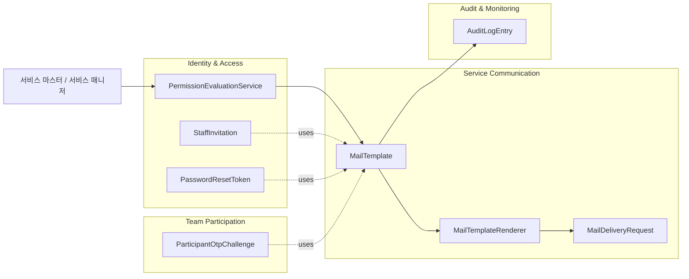
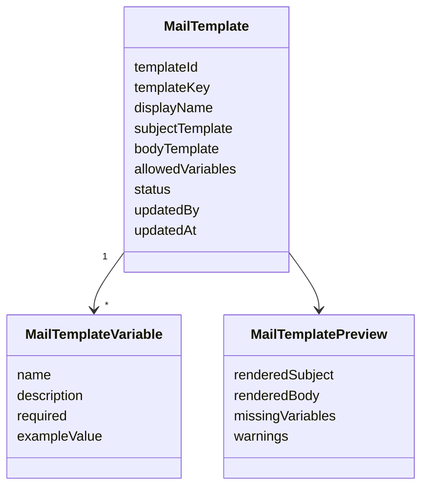
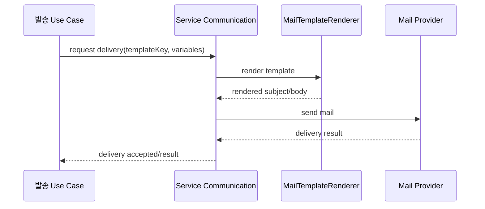
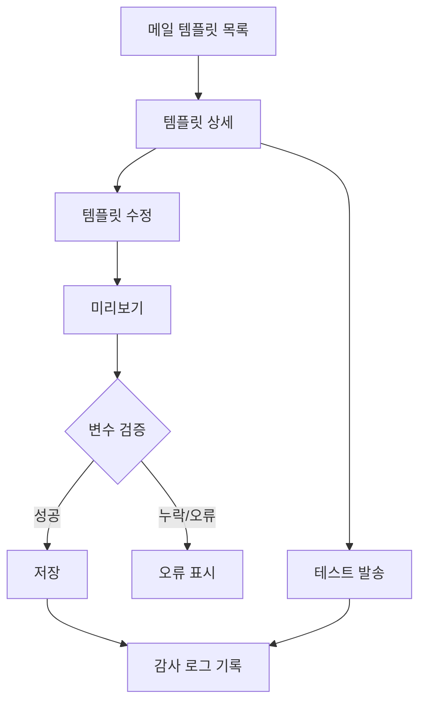
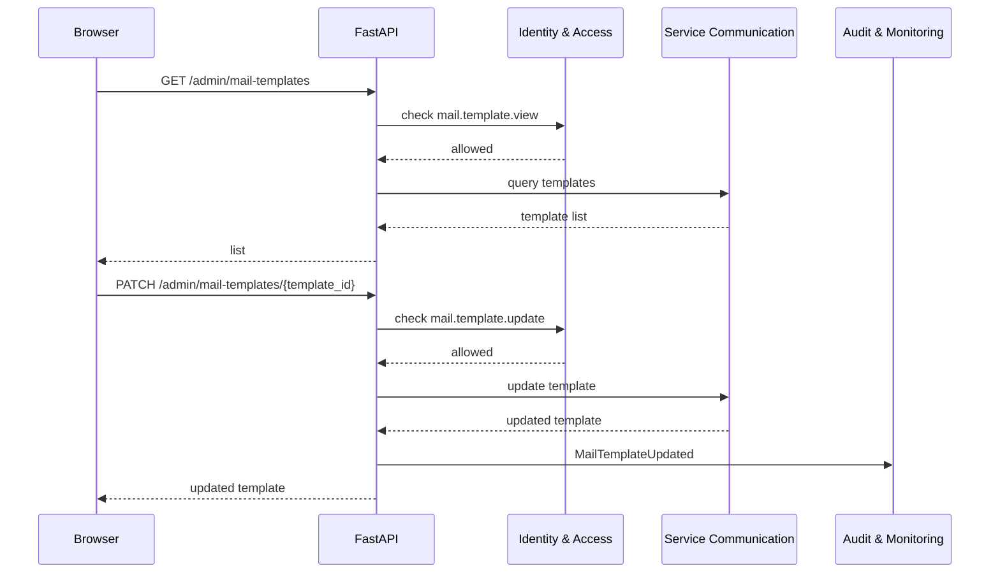

# 서비스 관리자 메일 템플릿 페이지 DDD

## 범위

이 문서는 서비스 관리자 영역의 메일 템플릿 조회/수정/미리보기 페이지를 다룬다.
메일 발송 자체가 아니라, 초대/비밀번호 설정/재설정/참가자 OTP 같은 발송 흐름에서 사용할 템플릿을 관리하는 기능이다.

## 포함 페이지

- 메일 템플릿 목록
- 메일 템플릿 상세
- 메일 템플릿 수정
- 템플릿 미리보기
- 테스트 발송 모달
- 변경 이력 보기

## 소유 컨텍스트



## 템플릿 종류

초기 템플릿 후보:

- 권한자 초대 메일
- 권한자 비밀번호 최초 설정 메일
- 권한자 비밀번호 재설정 메일
- 참가자 OTP 메일
- 참가 팀 등록 안내 메일
- 서비스 점검/운영 안내 메일

## 페이지별 책임

| 페이지 | 목적 | 필요 권한 | 주요 데이터 |
| --- | --- | --- | --- |
| 템플릿 목록 | 관리 가능한 템플릿 조회 | `mail.template.view` | 템플릿 key, 이름, 상태, 수정 시각 |
| 템플릿 상세 | 제목/본문/변수 확인 | `mail.template.view` | subject, body, variables |
| 템플릿 수정 | 제목/본문 변경 | `mail.template.update` | Markdown 기반 안전 렌더링 본문, 변수 |
| 미리보기 | 샘플 변수로 렌더링 확인 | `mail.template.view` | rendered subject/body |
| 테스트 발송 | 관리자 지정 주소로 테스트 | `mail.template.update` | 수신 이메일, 샘플 변수 |
| 변경 이력 | 변경 추적 | `audit_log.view` 또는 서비스 마스터 | 변경자, 변경 시각, diff |

## Aggregate / Read Model



## 템플릿 렌더링 흐름



## 관리자 플로우



## API 흐름



## API 초안

```text
GET /admin/mail-templates
GET /admin/mail-templates/{template_id}
POST /admin/mail-templates/{template_id}/preview
PATCH /admin/mail-templates/{template_id}
POST /admin/mail-templates/{template_id}/test-send
GET /admin/mail-templates/{template_id}/audit-logs
```

## 변수 정책

- 템플릿별 허용 변수 목록을 명시한다.
- 허용되지 않은 변수 사용은 저장 전에 차단한다.
- 필수 변수가 누락되면 preview와 저장에서 오류를 반환한다.
- 비밀값, OTP 원문, reset token 원문은 로그와 감사 로그에 남기지 않는다.
- 테스트 발송 시 실제 OTP나 reset token을 생성하지 않고 샘플 값을 사용한다.

## Command 후보

- `UpdateMailTemplate`
- `PreviewMailTemplate`
- `SendMailTemplateTest`
- `RestoreMailTemplateVersion`

## Domain Event 후보

- `MailTemplateUpdated`
- `MailTemplatePreviewed`
- `MailTemplateTestSent`
- `MailTemplateVersionRestored`

## 감사 로그 대상

- 템플릿 제목/본문 변경
- 템플릿 상태 변경
- 테스트 발송
- 이전 버전 복구

## 보안 원칙

- 템플릿 수정은 `mail.template.update` 권한이 필요하다.
- 템플릿 조회는 `mail.template.view` 권한이 필요하다.
- HTML 직접 입력을 허용할 경우 sanitizing 정책이 필요하므로, 초기에는 안전한 템플릿 문법과 Markdown 기반 렌더링을 우선한다.
- 테스트 발송은 rate limit을 적용한다.
- 발송 로그에는 수신자, 템플릿 key, 성공/실패 상태만 남기고 민감 변수 원문은 저장하지 않는다.

## 구현 메모

- 템플릿 key는 코드에서 참조하므로 운영자가 변경할 수 없게 한다.
- subject와 body는 버전 관리가 필요하다.
- 템플릿 미리보기는 실제 메일 발송 없이 렌더링 결과만 보여준다.
- 메일 제공자 장애는 템플릿 관리와 분리하고 delivery status로 추적한다.
