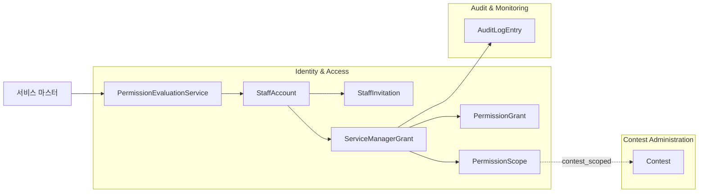
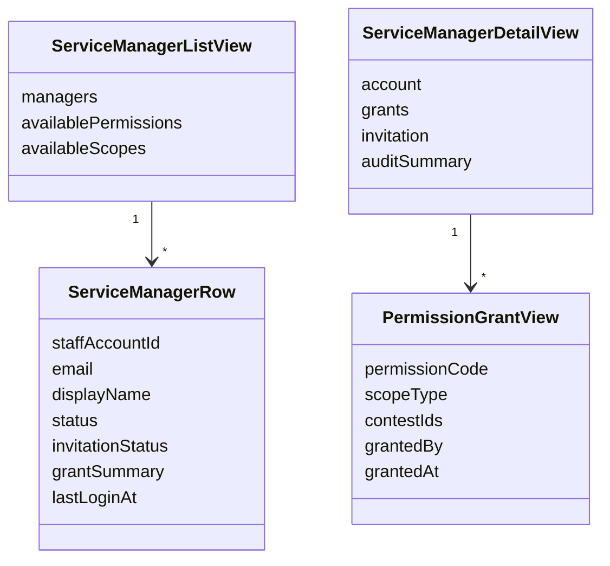
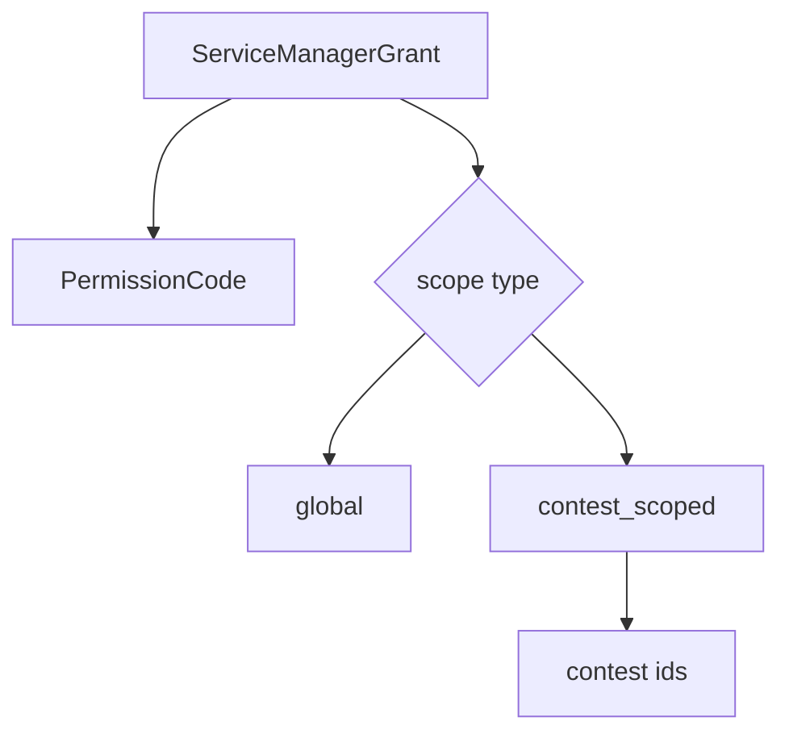
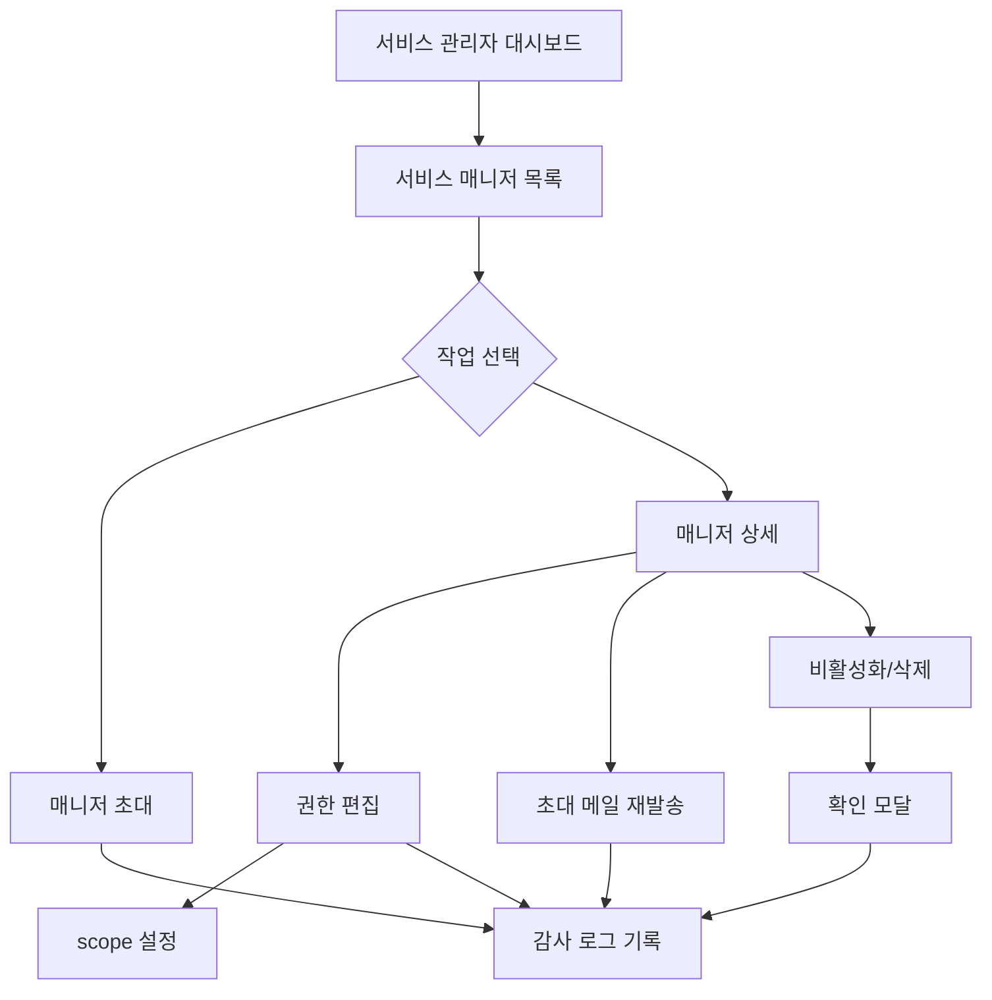
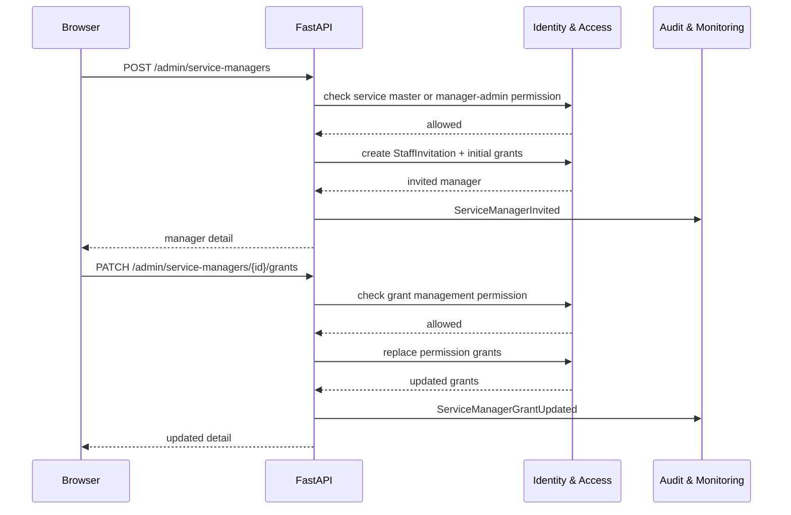

# 서비스 매니저 관리 페이지 DDD

## 범위

이 문서는 서비스 관리자 영역의 서비스 매니저 목록/초대/권한 수정/삭제 또는 비활성화 페이지를 다룬다.
서비스 매니저는 고정 역할이 아니라 permission grant 묶음과 scope로 권한을 받는 전역 운영 계정이다.

## 포함 페이지

- 서비스 매니저 목록
- 서비스 매니저 초대/추가 모달
- 서비스 매니저 상세
- 권한 체크리스트 편집
- 권한 scope 설정
- 초대 메일 재발송
- 비활성화/삭제 확인 모달
- 권한 변경 이력 보기

## 소유 컨텍스트



## 페이지별 책임

| 페이지 | 목적 | 필요 권한 | 주요 데이터 |
| --- | --- | --- | --- |
| 매니저 목록 | 서비스 매니저 계정과 상태 조회 | 서비스 마스터 또는 매니저 관리 권한 | 이름, 이메일, 상태, 권한 요약 |
| 초대/추가 | 새 서비스 매니저 초대 | 서비스 마스터 | 이메일, 표시명, 초기 권한 |
| 상세 | 계정 상태와 권한 확인 | 서비스 마스터 | 계정 정보, 초대 상태, 권한 목록 |
| 권한 편집 | permission grant 수정 | 서비스 마스터 | 권한 체크리스트, scope |
| scope 설정 | global 또는 contest_scoped 범위 지정 | 서비스 마스터 | 적용 대회 목록 |
| 비활성화/삭제 | 계정 접근 차단 | 서비스 마스터 | 영향 범위, 확인 문구 |
| 변경 이력 | 권한 변경 추적 | `audit_log.view` 또는 서비스 마스터 | 변경자, 변경 시각, 변경 요약 |

## Aggregate / Read Model



## 권한 Grant 모델



grant 원칙:

- `global` scope는 해당 permission을 서비스 전체에 적용한다.
- `contest_scoped` scope는 선택한 대회에만 permission을 적용한다.
- 같은 계정은 전역 권한과 특정 대회 권한을 함께 가질 수 있다.
- 서비스 마스터는 grant row 없이 모든 권한을 가진다.

## 사용자 플로우



## API 흐름



## API 초안

```text
GET /admin/service-managers
POST /admin/service-managers
GET /admin/service-managers/{manager_id}
PATCH /admin/service-managers/{manager_id}
PATCH /admin/service-managers/{manager_id}/grants
POST /admin/service-managers/{manager_id}/invitation/resend
POST /admin/service-managers/{manager_id}/disable
POST /admin/service-managers/{manager_id}/enable
DELETE /admin/service-managers/{manager_id}
GET /admin/service-managers/{manager_id}/audit-logs
```

## 권한 카탈로그 표시 기준

서비스 매니저 권한 체크리스트는 `service-level-permissions.md`의 permission catalog를 기준으로 구성한다.

카테고리:

- 대회 생성/개최
- 대회 기본 정보
- 대회 권한 인력 관리
- 참가 팀 관리
- 문제/채점 데이터 관리
- 제출/스코어보드/인프라
- 서비스 운영

## Command 후보

- `InviteServiceManager`
- `ResendServiceManagerInvitation`
- `UpdateServiceManagerProfile`
- `ReplaceServiceManagerGrants`
- `DisableServiceManager`
- `EnableServiceManager`
- `DeleteServiceManager`

## Domain Event 후보

- `ServiceManagerInvited`
- `ServiceManagerInvitationResent`
- `ServiceManagerProfileUpdated`
- `ServiceManagerGrantUpdated`
- `ServiceManagerDisabled`
- `ServiceManagerEnabled`
- `ServiceManagerDeleted`

## 감사 로그 대상

- 서비스 매니저 초대
- 초대 메일 재발송
- 권한 grant 변경
- scope 변경
- 계정 비활성화/활성화
- 계정 삭제

## 보안 원칙

- 서비스 매니저 관리 기능은 서비스 마스터 중심 기능으로 둔다.
- 자기 자신의 권한을 축소/확대하는 작업은 금지하거나 별도 정책으로 제한한다.
- 마지막 서비스 마스터 계정 삭제 또는 비활성화는 금지한다.
- 권한 변경 즉시 기존 세션의 권한 캐시를 무효화해야 한다.
- 권한 변경 이력은 장기 보관한다.

## 구현 메모

- permission grant 편집 UI는 checkbox만으로 끝내지 말고 scope 선택을 함께 제공해야 한다.
- contest scoped 권한을 선택하면 적용 대회 선택 UI가 필요하다.
- 권한 변경 전후 diff를 감사 로그에 남긴다.
- 삭제보다 비활성화를 기본 UX로 두고, hard delete는 별도 위험 작업으로 분리한다.
