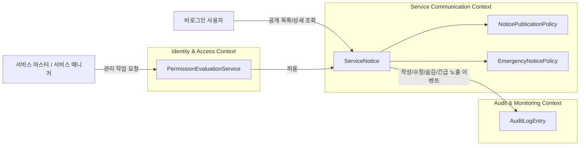
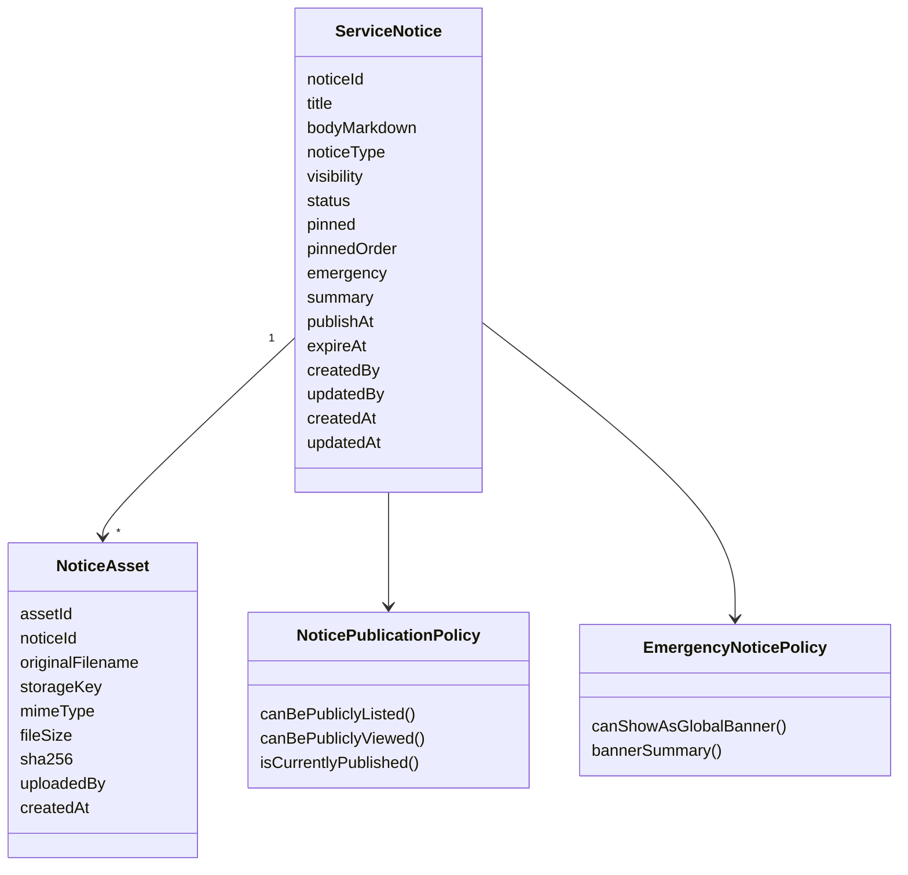
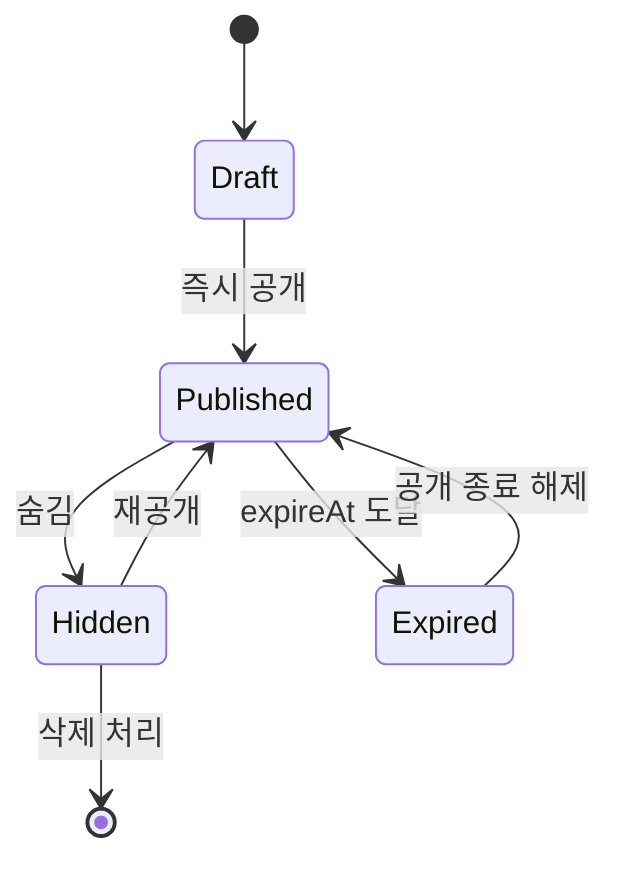
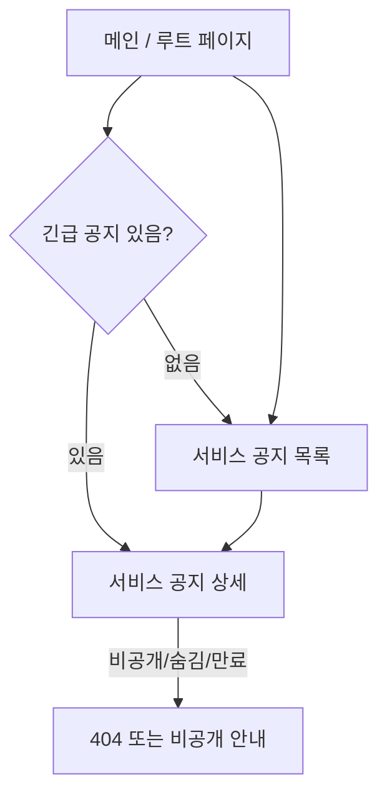
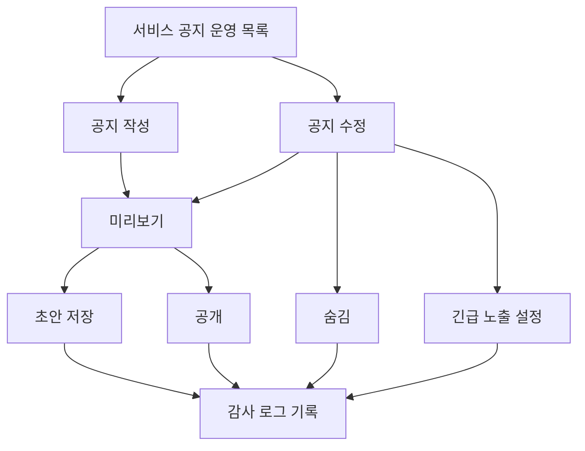
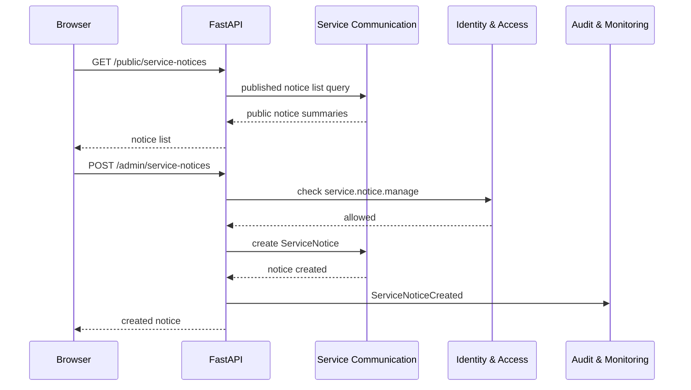
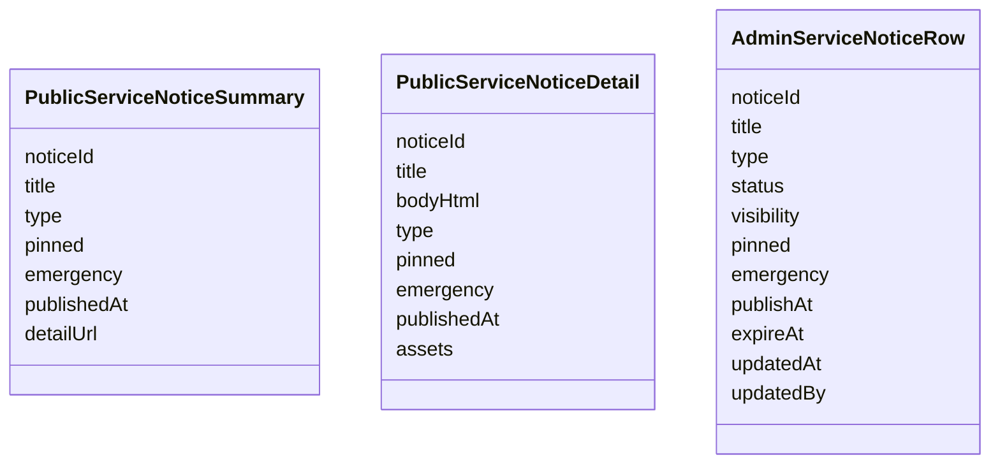

# 서비스 공지 게시판 페이지 DDD

## 범위

이 문서는 서비스 공지 게시판의 공개 페이지와 운영 관리 페이지를 다룬다.
서비스 공지는 특정 대회에 속하지 않는 전역 공지이며, 일반 이용자 글쓰기/댓글/답글 기능은 제공하지 않는다.

## 포함 페이지

- 서비스 공지 목록 페이지
- 서비스 공지 상세 페이지
- 전역 긴급 공지 배너
- 서비스 공지 운영 목록 페이지
- 서비스 공지 작성 페이지
- 서비스 공지 수정 페이지

## 소유 컨텍스트



## 페이지별 책임

| 페이지 | 목적 | 접근 권한 | 주요 데이터 |
| --- | --- | --- | --- |
| 서비스 공지 목록 | 공개된 서비스 공지 목록 조회 | 공개 | 공지 제목, 유형, 고정 여부, 긴급 여부, 공개 시각 |
| 서비스 공지 상세 | 공지 원문 확인 | 공개 또는 비공개 조회 권한 | 제목, 본문, 유형, 첨부 이미지, 공개 상태 |
| 전역 긴급 공지 배너 | 긴급 공지 요약 노출 | 공개 | 긴급 공지 제목, 요약, 상세 링크 |
| 운영 목록 | 전체 공지 상태 관리 | `service.notice.manage` 또는 `service.notice.view_private` | 공개/비공개/숨김/예약 상태 |
| 작성 | 새 서비스 공지 작성 | `service.notice.manage` | 제목, 본문, 유형, 공개 범위, 예약 시각 |
| 수정 | 기존 서비스 공지 수정 | `service.notice.manage` | 기존 공지 데이터, 변경 이력 대상 |

## Aggregate



## 상태 모델



상태 기준:

- `Draft`: 작성 중 또는 공개 전 내부 상태
- `Published`: 공개 목록과 상세에서 조회 가능
- `Hidden`: 공개 목록/상세에서 제외, 권한 있는 운영자만 조회
- `Expired`: 공개 종료 시각이 지나 공개 목록에서 제외

`pinned`와 `emergency`는 상태가 아니라 표시 정책이다.
예약 공지는 지원하지 않는다.

## 공개 사용자 플로우



공개 페이지 원칙:

- `Published` 상태이고 현재 시각이 공개 기간 안에 있는 공지만 목록에 노출한다.
- 숨김, 비공개 공지는 공개 API에서 존재 여부를 드러내지 않는다.
- 긴급 공지 배너는 요약만 노출하고 상세 페이지 링크를 제공한다.

## 운영자 플로우



운영 페이지 원칙:

- 작성/수정/숨김은 `service.notice.manage` 권한이 필요하다.
- 긴급 공지 노출 설정/해제는 `service.notice.emergency_publish` 권한이 필요하다.
- 비공개/숨김 공지 조회는 `service.notice.view_private` 권한이 필요하다.
- 예약 공지는 지원하지 않는다.
- 서비스 마스터는 모든 권한 검사를 통과한다.

## API 흐름



## API 초안

공개 API:

```text
GET /public/service-notices
GET /public/service-notices/{notice_id}
```

운영 API:

```text
GET /admin/service-notices
GET /admin/service-notices/{notice_id}
POST /admin/service-notices
PATCH /admin/service-notices/{notice_id}
POST /admin/service-notices/{notice_id}/publish
POST /admin/service-notices/{notice_id}/hide
POST /admin/service-notices/{notice_id}/pin
POST /admin/service-notices/{notice_id}/unpin
POST /admin/service-notices/{notice_id}/emergency
POST /admin/service-notices/{notice_id}/emergency/clear
```

## Read Model



## Command 후보

- `CreateServiceNotice`
- `UpdateServiceNotice`
- `PublishServiceNotice`
- `ScheduleServiceNotice`
- `HideServiceNotice`
- `PinServiceNotice`
- `UnpinServiceNotice`
- `MarkServiceNoticeEmergency`
- `ClearServiceNoticeEmergency`

## Domain Event 후보

- `ServiceNoticeCreated`
- `ServiceNoticeUpdated`
- `ServiceNoticePublished`
- `ServiceNoticeScheduled`
- `ServiceNoticeHidden`
- `ServiceNoticePinned`
- `ServiceNoticeUnpinned`
- `ServiceNoticeEmergencyMarked`
- `ServiceNoticeEmergencyCleared`

## 구현 메모

- 본문 원본은 Markdown으로 저장하고, 렌더링 결과는 응답 시 변환하거나 캐시한다.
- HTML 직접 입력은 허용하지 않는다.
- 이미지 파일은 `asset_id`와 `storage_key` 기반으로 관리하고 실제 파일 경로를 공개하지 않는다.
- 이미지는 `jpg`, `jpeg`, `png`, `webp` 확장자만 허용하고 파일당 최대 `512MB`로 제한한다.
- 외부 URL 이미지는 허용하지 않는다.
- 공개 상세 API는 숨김/비공개/예약 대기 공지의 존재 여부를 드러내지 않는다.
- 운영 목록에서는 공개 상태, 예약 상태, 긴급 노출 상태를 한 번에 확인할 수 있어야 한다.
