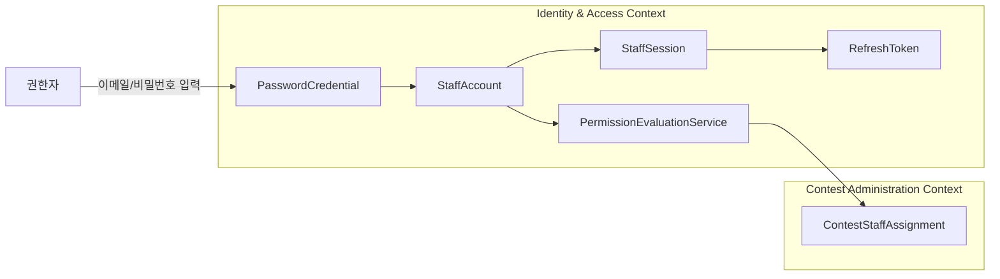
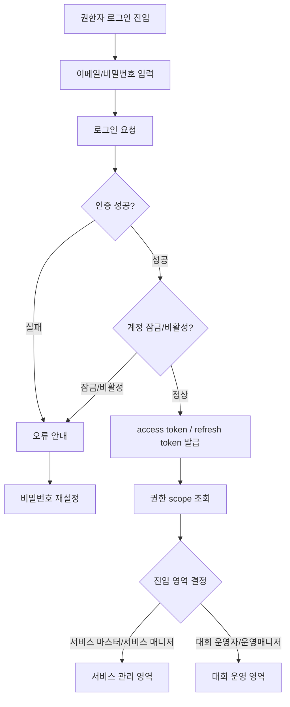
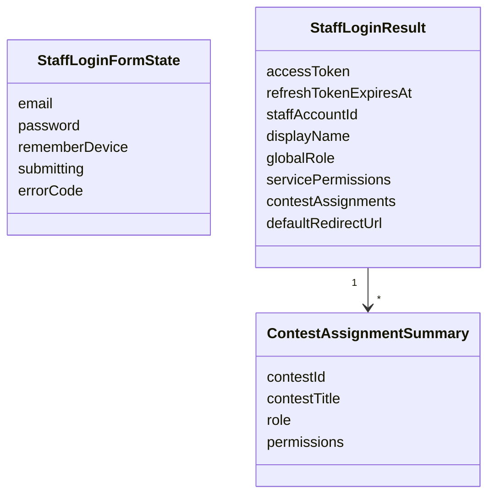
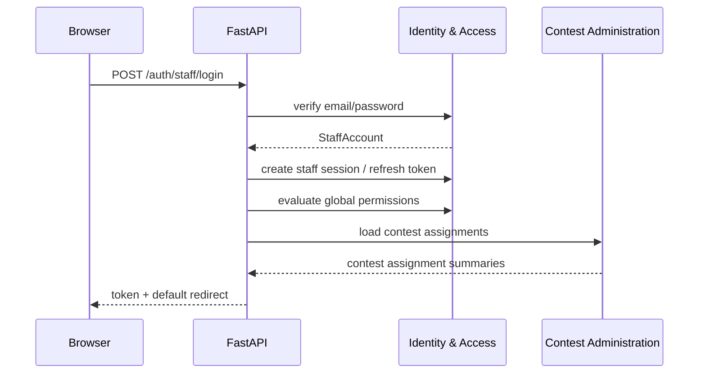

# 서비스 관리자 로그인 페이지/모달 DDD

## 범위

이 문서는 서비스 마스터, 서비스 매니저, 대회 운영자, 대회 운영매니저가 사용하는 권한자 로그인 페이지와 로그인 모달을 다룬다.
참가자 이메일 OTP 로그인과 분리된 이메일/비밀번호 기반 로그인이다.

## 포함 UI

- 권한자 로그인 페이지
- 권한자 로그인 모달
- 비밀번호 최초 설정 진입
- 비밀번호 재설정 진입
- 로그인 실패/잠금 안내
- 로그인 성공 후 권한별 redirect

## 소유 컨텍스트



## 로그인 플로우



## 페이지/모달 차이

| UI | 사용 위치 | 성공 처리 | 실패 처리 |
| --- | --- | --- | --- |
| 로그인 페이지 | `/admin/login` 직접 진입 | 권한별 기본 영역으로 redirect | 화면 내 오류 표시 |
| 로그인 모달 | 보호된 페이지 접근 중 세션 만료 | 원래 요청한 페이지로 복귀 | 모달 내 오류 표시 |

모달은 세션 만료 복구용으로 사용하고, 최초 진입은 페이지를 기본으로 둔다.

## Read Model



## API 흐름



## API 초안

```text
POST /auth/staff/login
POST /auth/staff/logout
POST /auth/staff/refresh
GET /auth/staff/me
POST /auth/staff/password-reset/request
POST /auth/staff/password-reset/confirm
POST /auth/staff/password-setup/confirm
```

## 보안 원칙

- 참가자 OTP 로그인과 권한자 로그인은 URL, UI, API를 분리한다.
- 권한자 로그인은 이메일과 비밀번호 기반 JWT를 사용한다.
- refresh token은 DB에 해시 형태로 저장한다.
- 로그인 실패 횟수와 IP 기준 rate limit을 적용한다.
- 실패 메시지는 계정 존재 여부를 직접 노출하지 않는다.
- 비밀번호 재설정/최초 설정 토큰은 원문 저장을 금지한다.
- 로그인 성공 후 접근 가능한 메뉴는 서버가 계산한 권한과 scope를 기준으로 노출한다.

## Domain Event 후보

- `StaffLoginSucceeded`
- `StaffLoginFailed`
- `StaffSessionCreated`
- `StaffSessionRevoked`
- `StaffPasswordResetRequested`
- `StaffPasswordChanged`

## 구현 메모

- 서비스 마스터는 서비스 관리 영역으로 기본 이동한다.
- 서비스 매니저는 보유한 permission에 따라 서비스 관리 메뉴 일부만 볼 수 있다.
- 서비스 마스터는 개별 대회 운영 영역에 직접 진입할 수 있다.
- 서비스 매니저는 보유한 permission과 scope가 허용하는 개별 대회 운영 영역에 직접 진입할 수 있다.
- 대회 운영자/운영매니저만 있는 계정은 담당 대회 운영 영역으로 이동한다.
- 서비스 권한과 대회 권한을 모두 가진 계정은 진입 영역 선택 UI가 필요할 수 있다.
