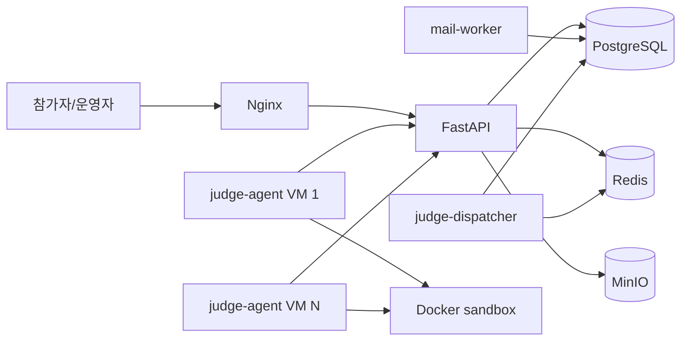
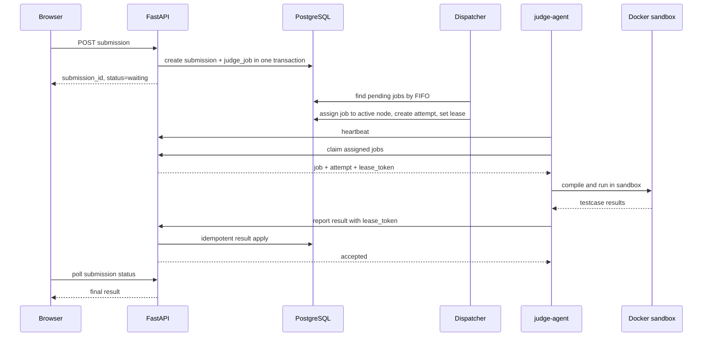
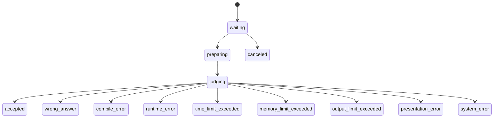
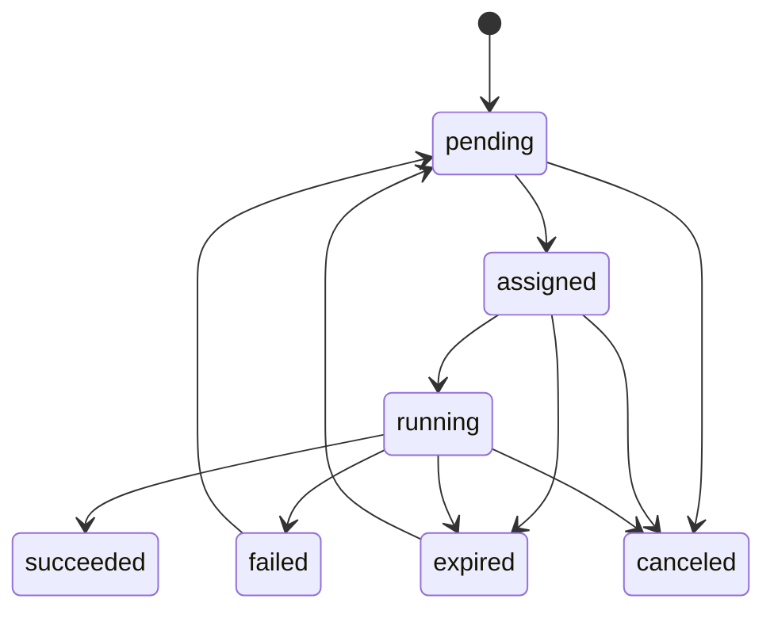
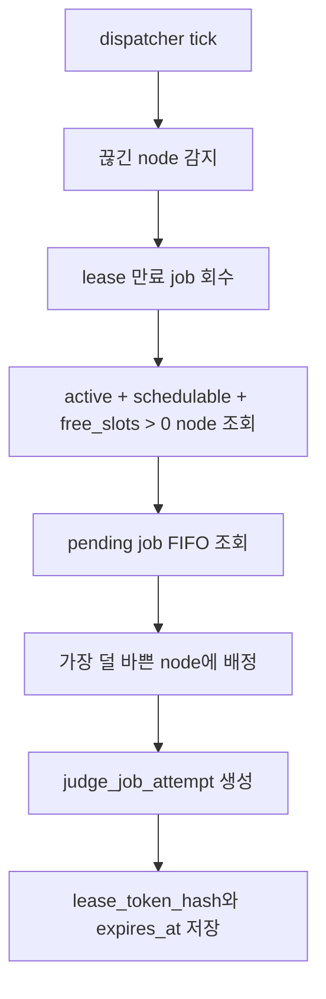
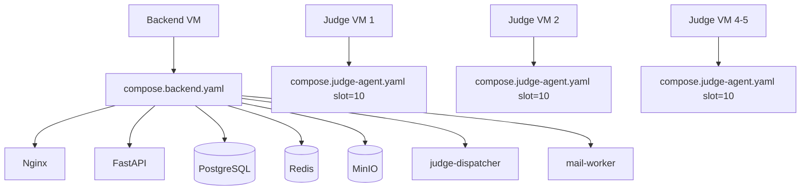
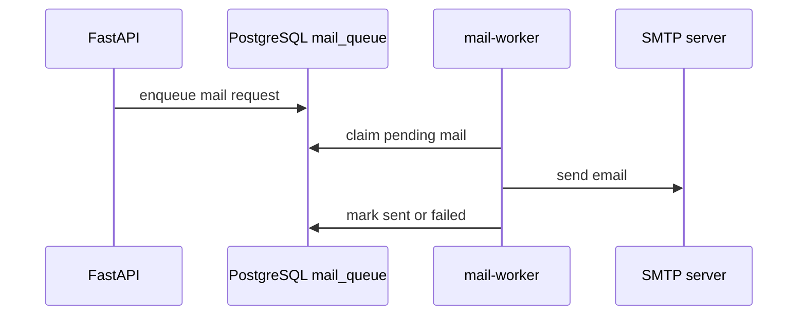

# 백엔드와 채점기 동작 방식

## 구성



## 핵심 원칙

- 사용자는 Nginx와 FastAPI에만 접근한다.
- 제출 코드는 FastAPI에서 직접 실행하지 않는다.
- `submissions`와 `judge_jobs`는 같은 DB transaction 안에서 생성한다.
- 제출 코드, 테스트케이스, 문제 리소스, 채점 산출물은 MinIO에 저장한다.
- dispatcher가 job을 어느 judge node에 줄지 결정한다.
- agent는 자기 node에 배정된 job만 가져와 실행한다.
- agent VM은 외부 inbound를 열지 않고, 내부 API로 outbound 요청만 한다.

## 제출부터 결과까지



## 상태 흐름

### 제출 상태



### 채점 job 상태



## Dispatcher 배정 방식



FIFO 기준:

```text
priority DESC, queue_position ASC
```

기본값:

| 항목 | 값 |
| --- | --- |
| heartbeat 주기 | 5초 |
| node lost 판단 | 30초 |
| lease TTL | 120초 |
| lease 연장 주기 | 30초 |
| 최대 재시도 | 3회 |

## Agent가 호출하는 내부 API

| API | 목적 |
| --- | --- |
| `POST /internal/judge/nodes/register` | judge node 등록 |
| `POST /internal/judge/nodes/{node_id}/heartbeat` | slot, 실행 중 job, 버전 보고 |
| `POST /internal/judge/nodes/{node_id}/assignments:claim` | 배정된 job 가져오기 |
| `POST /internal/judge/jobs/{job_id}/result` | 성공적으로 채점한 결과 보고 |
| `POST /internal/judge/jobs/{job_id}/failure` | agent/sandbox 인프라 실패 보고 |

## 결과 반영 규칙

- 채점 결과가 `wrong_answer`, `compile_error`, `runtime_error`여도 job은 정상 수행된 것이므로 `succeeded`다.
- Docker 실행 실패, 테스트케이스 파일 접근 실패, agent 내부 오류는 job `failed`다.
- 결과 반영은 `judge_job_attempt_id` 기준으로 한 번만 처리한다.
- lease token이 다르면 `409 lease_conflict`로 거부한다.
- max retry를 넘으면 제출은 `system_error`로 확정한다.

## 채점 기능 테스트 작성 기준

채점 구현은 dispatcher, internal API, result apply를 나눠서 테스트한다.

필수 테스트:

- 제출 생성 시 `submissions`와 `judge_jobs`가 같은 transaction 안에서 생성된다.
- dispatcher가 FIFO 순서로 pending job을 배정한다.
- free slot이 없는 node에는 배정하지 않는다.
- heartbeat가 끊긴 node의 lease는 만료 후 회수된다.
- agent가 자기 node에 배정된 job만 claim할 수 있다.
- result report는 `judge_job_attempt_id` 기준으로 idempotent하게 처리된다.
- 잘못된 lease token은 `409 lease_conflict`로 거부된다.
- retry 초과 시 submission이 `system_error`로 확정된다.

권장 테스트 파일 예시:

```text
backend/tests/domain/test_judge_job_state.py
backend/tests/application/test_dispatcher_assignment.py
backend/tests/api/test_judge_internal_api.py
backend/tests/application/test_judge_result_apply.py
```

## Docker Compose 배치



초기 운영 추천:

- Backend VM 1대
- Judge VM 4~5대
- Judge VM당 `JUDGE_TOTAL_SLOTS=10`
- Judge VM당 권장 자원은 `10~12 vCPU`, `20GB RAM`
- CPU 기준은 E5-2698 v4 기반 Proxmox host

## 메일 발송



메일은 SMTP를 직접 사용한다.
OTP, 권한자 초대, 비밀번호 재설정은 같은 mail queue와 mail-worker를 사용한다.
