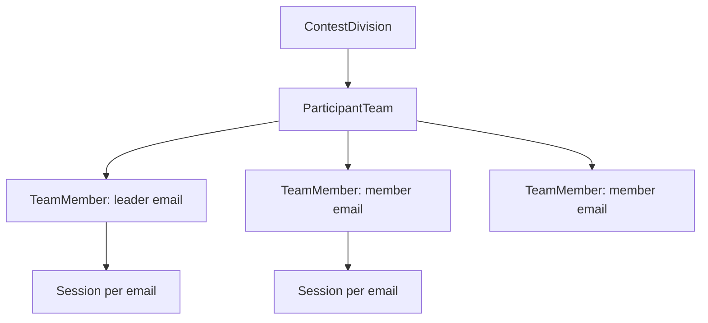

# 확정 정책 요약

이 문서는 백엔드 구현 전에 확정된 운영 정책만 모아 둔다.
상세 모델과 API는 각 상세 문서를 따른다.

## 참가팀 등록과 로그인

대회 운영진이 참가팀을 직접 등록한다.

등록 정보:

| 항목 | 필수 |
| --- | --- |
| 팀 이름 | yes |
| 팀장 이름 | yes |
| 팀장 이메일 | yes |
| 팀원 이름 | yes |
| 팀원 이메일 | yes |
| 참가 유형 | yes |

로그인 기준:

- 로그인 식별자는 참가자 이메일이다.
- OTP는 로그인한 참가자 이메일로 발송한다.
- 세션은 팀 단위가 아니라 참가자 이메일 단위로 유지한다.
- 동시 접속도 참가자 이메일 단위로 관리한다.
- 같은 팀의 여러 참가자는 각자 자기 이메일 OTP로 로그인한다.
- 팀은 하나의 참가 유형에만 속한다.
- 참가자는 로그인하면 등록된 참가 유형 워크스페이스로 바로 이동한다.

## 대회 참가 유형

- 한 대회 안에 여러 참가 유형을 둘 수 있다.
- 참가 유형은 `contest_division`으로 관리한다.
- 참가 유형이 2개 이상이면 참가팀 등록 시 운영자가 유형 중 하나를 반드시 지정해야 한다.
- 참가팀은 대회 중 정확히 하나의 참가 유형만 가질 수 있고, 중복 배정은 허용하지 않는다.
- 유형은 대회 이름과 일정만 공유한다.
- 문제/제출/스코어보드/채점 이력은 유형별로 완전히 분리한다.
- 구현과 운영 관점에서는 참가 유형별로 사실상 다른 대회처럼 취급한다.
- 참가자 API는 로그인한 이메일의 팀 유형과 다른 유형의 문제 제출을 허용하지 않는다.
- 참가자는 로그인하면 자기 팀에 지정된 참가 유형의 문제집/스코어보드/제출 현황만 본다.
- 운영자 화면은 전체 보기와 유형별 상세 보기를 모두 제공한다.

## 대회 공개 정책

- `scheduled` 대회는 공개 목록과 공개 상세에서 보이지 않는다.
- `scheduled` 대회는 대회 운영진과 서비스 관리자만 볼 수 있다.
- 비공개 대회와 공개 예정 대회는 공개 API에서 `404 not_found`로 숨긴다.
- 종료 후 공개 여부는 대회 설정에서 아래 항목을 각각 제어한다.
  - 문제 공개
  - 스코어보드 공개
  - 제출 현황 공개

## 제출 정책

- 대회 종료 시각 전까지 제출 가능하다.
- 대회 종료 시각 이후 제출은 불가능하다.
- 최소 제출 간격은 없다.
- 제출 rate limit은 없다.
- 소스 코드 크기는 안전 상한만 둔다.
- MVP 기본 소스 코드 최대 크기는 `512 KiB`로 두고 env로 조정한다.

지원 언어:

| language | version |
| --- | --- |
| C | C99 |
| C++ | C++17 |
| Python | Python 3.13 |
| Java | Java 8 |

## AC/WA 스코어링

- `accepted`만 정답이다.
- `compile_error`는 페널티에서 제외한다.
- `accepted`를 제외한 나머지 최종 판정은 오답으로 본다.
- 오답 페널티 기준 시각은 `submitted_at`이다.
- 이미 맞은 문제를 다시 맞아도 최초 accepted 제출 시각을 유지한다.

## 점수제 스코어링

- 점수는 채점 완료 즉시 반영한다.
- 문제별 최고 점수만 반영한다.
- 새 제출 점수가 기존 최고 점수보다 높으면 점수와 점수 달성 제출 시각을 갱신한다.
- 새 제출 점수가 기존 최고 점수와 같거나 낮으면 기존 점수와 기존 달성 시각을 유지한다.
- 같은 문제를 다시 맞아도 기존 점수 달성 시각을 유지한다.

## 스코어보드 프리즈와 공개

- 프리즈 기본값은 대회 종료 1시간 전이다.
- 프리즈 이후 참가자/공개 사용자는 프리즈 시점의 순위만 본다.
- 운영자 전용 상세 스코어보드는 실제 최신 점수를 보여준다.
- 종료 후 스코어보드는 자동 공개하지 않는다.
- 종료 후 공개는 수동 공개만 허용한다.
- 종료 후 결과는 팀별로 개별 공개할 수 있어야 한다.

## 재채점과 채점 이력

- 수동 재채점은 제공하지 않는다.
- 대회 운영자, 대회 운영매니저, 서비스 마스터 모두 재채점을 요청할 수 없다.
- `judge.job.retry` 같은 재채점 권한명은 사용하지 않는다.
- 참가자는 대회 중 자기 팀의 채점 이력만 볼 수 있다.
- 대회 운영자 전용 채점 이력 페이지가 필요하다.
- 대회 운영자는 모든 팀의 채점 이력을 볼 수 있지만 재채점 요청은 할 수 없다.

## 질문 게시판

- 참가자는 질문 작성 시 공개/비공개를 선택할 수 있다.
- 운영자는 비공개 질문을 공개 질문으로 전환할 수 없다.
- 답변은 전체 공개 또는 질문자만 공개를 선택할 수 있다.
- 운영자는 공개/비공개 질문과 댓글을 모두 볼 수 있다.
- 운영자 화면에는 질문과 댓글이 공개로 작성됐는지 비공개로 작성됐는지 표시해야 한다.

## 공지

- 긴급 공지는 최근 1개만 노출한다.
- 대회 긴급 공지가 서비스 긴급 공지보다 우선한다.
- 예약 공지는 지원하지 않는다.

## 파일과 채점 통신

- 파일 저장소는 MinIO를 사용한다.
- 문제 리소스, 테스트케이스, 제출 코드, 채점 산출물은 MinIO에 저장한다.
- DB에는 실제 파일 경로가 아니라 `storage_key`와 metadata를 저장한다.
- judge-agent는 내부 API 기반으로 필요한 메타데이터와 파일 접근 정보를 받는다.
- Backend VM과 Judge VM은 같은 서버의 VM이므로 내부 IP 통신을 기본으로 한다.

## 채점 워커

- judge-agent VM당 기본 slot은 10이다.
- 각 judge VM 권장 자원은 `10~12 vCPU`, `20GB RAM`이다.
- CPU 기준은 E5-2698 v4 기반 Proxmox host다.
- 각 slot은 컴파일, 실행, 비교 전체 파이프라인을 포함한다.

## 실시간 갱신

- 제출 상태, 채점 상태, 스코어보드 갱신은 long polling으로 시작한다.
- SSE/WebSocket은 MVP 필수로 두지 않는다.

## 메일

- SMTP를 직접 사용한다.
- 백엔드는 메일 발송 요청을 DB queue에 적재한다.
- 별도 mail worker가 queue를 소비해 SMTP로 발송한다.
- OTP, 초대, 비밀번호 재설정 메일은 같은 mail queue를 사용한다.

## 감사와 개인정보

- 운영 감사 로그는 영구 보존한다.
- 참가팀 정보는 대회 운영자가 등록한다.
- 참가자 개인정보는 이름과 이메일만 저장한다.
- 참가팀 정보는 대회 관리 페이지에서 권한 있는 사용자만 볼 수 있다.
- 참가팀 정보는 자동 삭제하지 않는다.

## 백업

- PostgreSQL 백업은 필수다.
- MinIO object data와 metadata도 백업 대상이다.
- 기본 추천은 매일 full dump와 WAL archive 조합이다.
- 대회 당일에는 대회 시작 전 수동 백업과 종료 후 수동 백업을 추가한다.
