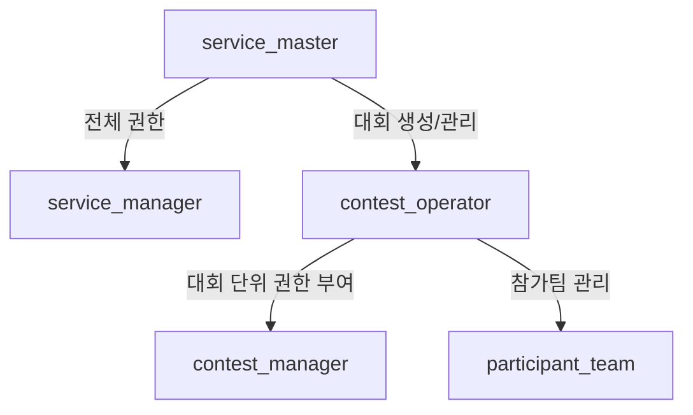
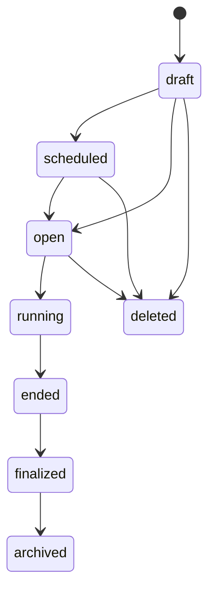
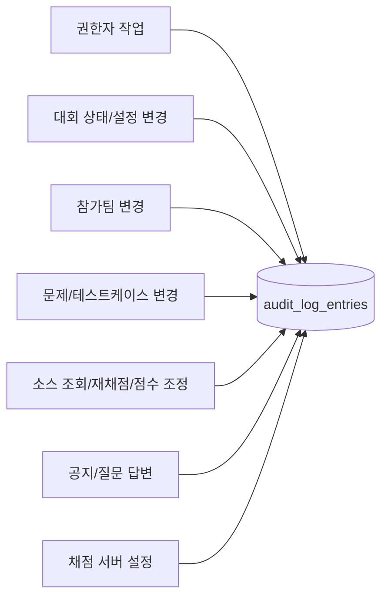

# 대회 운영과 권한 요약

## 역할 구조



## 역할별 의미

| 역할 | 범위 | 권한 방식 |
| --- | --- | --- |
| `service_master` | 서비스 전체 | 모든 권한 통과 |
| `service_manager` | 전역 또는 특정 대회 | permission grant |
| `contest_operator` | 특정 대회 | 해당 대회 모든 `contest.*` 권한 통과 |
| `contest_manager` | 특정 대회 | permission grant |
| `participant_team` | 특정 대회 참가 | 운영 권한 없음 |

역할 충돌:

- 같은 대회에서 운영자/운영매니저는 참가팀이 될 수 없다.
- 다른 대회에서는 다른 역할을 가질 수 있다.

## 대회 lifecycle



## 운영 단계별 주요 작업

| 단계 | 가능한 주요 작업 | 주의 |
| --- | --- | --- |
| `draft` | 대회 정보, 참가 정책, 문제, 테스트케이스 등록 | 내부 준비 단계 |
| `scheduled` | 운영진 사전 점검 | 공개 목록에는 노출하지 않음 |
| `open` | 참가자 안내, 로그인 준비 | 문제 제출은 아직 불가 |
| `running` | 제출, 채점, 공지, 질문 대응 | 문제 본문/데이터 수정 기본 금지 |
| `ended` | 수동 점수 조정 | 당시 스코어보드 자동 변경 금지 |
| `finalized` | 공식 결과 확정 | 이후 결과 고정 |
| `archived` | 보관과 공개 조회 | 공개 정책에 따름 |

## 권한 scope

| scope_type | 의미 | 예시 |
| --- | --- | --- |
| `global` | 서비스 전체에 적용 | 모든 대회 조회, 전역 공지 관리 |
| `contest` | 특정 대회에만 적용 | 한 대회 참가팀 관리 |

예시:

```text
permission_code = contest.participant.update
scope_type = contest
scope_contest_id = contest A
```

이 경우 contest A의 참가팀만 수정할 수 있다.

## 서비스 권한

| 작업 | 권한명 |
| --- | --- |
| 서비스 공지 조회 | `service.notice.view` |
| 비공개/숨김 공지 조회 | `service.notice.view_private` |
| 서비스 공지 작성/수정/숨김 | `service.notice.manage` |
| 긴급 서비스 공지 설정 | `service.notice.emergency_publish` |
| 메일 템플릿 조회 | `mail.template.view` |
| 메일 템플릿 수정 | `mail.template.update` |
| 감사 로그 조회 | `audit_log.view` |

## 대회 생성/상태 권한

| 작업 | 권한명 |
| --- | --- |
| 대회 조회 | `contest.view` |
| 대회 생성 | `contest.create` |
| 대회 공개 | `contest.open` |
| 대회 시작 | `contest.start` |
| 대회 종료 | `contest.close` |
| 대회 최종 확정 | `contest.finalize` |
| 대회 보관 | `contest.archive` |
| 대회 삭제 | `contest.delete` |

## 대회 설정 권한

| 작업 | 권한명 |
| --- | --- |
| 기본 정보 수정 | `contest.update_basic` |
| 일정 수정 | `contest.update_schedule` |
| 개최 기관 수정 | `contest.update_organization` |
| 개요 수정 | `contest.update_overview` |
| 규정 수정 | `contest.update_rule` |
| 공개 정책 수정 | `contest.update_visibility` |
| 참가 정책 조회 | `contest.participant_policy.view` |
| 참가 정책 수정 | `contest.participant_policy.update` |
| 채점 정책 조회/수정 | `contest.scoring_policy.view`, `contest.scoring_policy.update` |
| 점수 계산 정책 조회/수정 | `contest.score_calculation_policy.view`, `contest.score_calculation_policy.update` |

## 운영 인력 권한

| 작업 | 권한명 |
| --- | --- |
| 운영자 조회 | `contest.operator.view` |
| 운영자 초대 | `contest.operator.invite` |
| 운영자 수정 | `contest.operator.update` |
| 운영자 제거 | `contest.operator.remove` |
| 매니저 조회 | `contest.manager.view` |
| 매니저 초대 | `contest.manager.invite` |
| 매니저 권한 수정 | `contest.manager.permission_update` |
| 매니저 제거 | `contest.manager.remove` |

## 참가팀 권한

| 작업 | 권한명 |
| --- | --- |
| 참가팀 조회 | `contest.participant.view` |
| 참가팀 생성 | `contest.participant.create` |
| 참가팀 수정 | `contest.participant.update` |
| 참가팀 삭제 | `contest.participant.remove` |
| 참가팀 일괄 생성 | `contest.participant.bulk_create` |
| 참가 메일 재발송 | `contest.participant.mail_resend` |
| 팀 상태 조회 | `contest.team_status.view` |
| 팀 실시간 상태 조회 | `contest.team_status.realtime_view` |

## 문제/테스트케이스 권한

| 작업 | 권한명 |
| --- | --- |
| 문제 조회/생성/수정/삭제 | `contest.problem.view`, `contest.problem.create`, `contest.problem.update`, `contest.problem.delete` |
| 문제 순서 변경 | `contest.problem.reorder` |
| 문제 리소스 조회/관리 | `contest.problem.resource.view`, `contest.problem.resource.manage` |
| 테스트케이스 조회/관리 | `contest.testcase.view`, `contest.testcase.manage` |
| 제너레이터 조회/관리 | `contest.generator.view`, `contest.generator.manage` |

## 제출/스코어보드 권한

| 작업 | 권한명 |
| --- | --- |
| 제출 조회 | `contest.submission.view` |
| 제출 소스 조회 | `contest.submission.source.view` |
| 제출 취소 | `contest.submission.cancel` |
| 제출 내보내기 | `contest.submission.export` |
| 스코어보드 조회 | `contest.scoreboard.view` |
| 스코어보드 프리즈/해제 | `contest.scoreboard.freeze`, `contest.scoreboard.unfreeze` |
| 스코어보드 설정 | `contest.scoreboard.setting` |
| 수동 점수 조정 | `contest.scoreboard.score_adjust` |
| 최종 스코어보드 확정 | `contest.scoreboard.finalize` |
| 대회 큐 조회 | `contest.judge_queue.view` |

## 대회 공지/질문 권한

| 작업 | 권한명 |
| --- | --- |
| 대회 공지 조회/생성/수정/삭제 | `contest.notice.view`, `contest.notice.create`, `contest.notice.update`, `contest.notice.delete` |
| 긴급 대회 공지 | `contest.notice.emergency_publish` |
| 질문 조회 | `contest.board.question.view` |
| 질문 공개 범위 수정 | `contest.board.question.update_visibility` |
| 답변 생성/수정/삭제 | `contest.board.answer.create`, `contest.board.answer.update`, `contest.board.answer.delete` |

## 채점 인프라 권한

| 작업 | 권한명 |
| --- | --- |
| 전역 큐 조회 | `judge.queue.view` |
| job retry / 재채점 | 사용하지 않음 |
| job cancel | `judge.job.cancel` |
| 서버 조회 | `judge.server.view` |
| slot/scale 변경 | `judge.server.scale` |
| 서버 설정 변경 | `judge.server.config_update` |
| 클러스터 정책 변경 | `judge.cluster.policy_update` |

## 참가팀 등록 정책

대회 운영자는 참가팀을 직접 등록한다.

| 등록 항목 | 설명 |
| --- | --- |
| 팀 이름 | 대회 내 unique |
| 참가 유형 | 팀당 1개만 지정 |
| 팀장 이름/이메일 | 팀장도 참가자 이메일 세션을 가진다 |
| 팀원 이름/이메일 | 팀원 수만큼 등록 |

참가자는 자기 이메일로 OTP를 받고 로그인한다.
세션과 동시 접속 제한도 참가자 이메일별로 관리한다.

## 참가 유형 운영 정책

- 대회 운영자는 참가팀 등록 시 반드시 참가 유형을 지정한다.
- 참가 유형이 2개 이상이면 팀 등록 시 유형 중 하나가 반드시 선택되어 있어야 한다.
- 한 참가팀은 정확히 하나의 참가 유형만 가진다.
- 중복 유형 배정은 허용하지 않는다.
- 참가자는 로그인 후 자기 팀에 지정된 유형 워크스페이스로 이동한다.
- 문제, 제출, 스코어보드, 채점 이력은 유형별로 완전히 분리한다.
- 대회 이름만 공유할 뿐, 운영/구현 관점에서는 유형별로 사실상 다른 대회처럼 취급한다.
- 운영자는 전체 현황과 유형별 상세 현황을 모두 볼 수 있다.
- 권한명은 기존 `contest.*` 범위를 유지하고, 요청 context의 `contest_id`와 `division_id`로 대상 범위를 좁힌다.

## 재채점 정책

- 수동 재채점은 제공하지 않는다.
- 대회 운영자/운영매니저와 서비스 마스터 모두 재채점을 요청할 수 없다.
- `judge.job.retry` 권한명은 사용하지 않는다.
- 운영자 전용 채점 이력 페이지는 필요하지만, 재채점 버튼은 제공하지 않는다.

## 감사 로그 대상



감사 로그에는 작업자, 대상, 대회, 작업 코드, 변경 전/후 요약, IP, 발생 시각을 남긴다.

## 운영/권한 테스트 작성 기준

권한과 운영 상태는 기능 구현 중 반드시 같이 테스트한다.

필수 테스트:

- `service_master`는 모든 권한 검사를 통과한다.
- `contest_operator`는 해당 대회의 모든 `contest.*` 권한을 가진다.
- `contest_manager`는 grant된 권한만 통과한다.
- `global` scope 권한은 모든 대회에 적용된다.
- `contest` scope 권한은 지정 대회에만 적용된다.
- 같은 대회에서 운영자/운영매니저와 참가팀 역할 충돌이 차단된다.
- 대회 상태별 금지 작업은 `409 invalid_state_transition`으로 실패한다.
- 감사 로그 대상 작업은 성공 시 `audit_log_entries`에 기록된다.

권장 테스트 파일 예시:

```text
backend/tests/domain/test_permission_evaluation.py
backend/tests/domain/test_contest_state_transition.py
backend/tests/application/test_contest_staff_assignment.py
backend/tests/application/test_audit_logging.py
```
