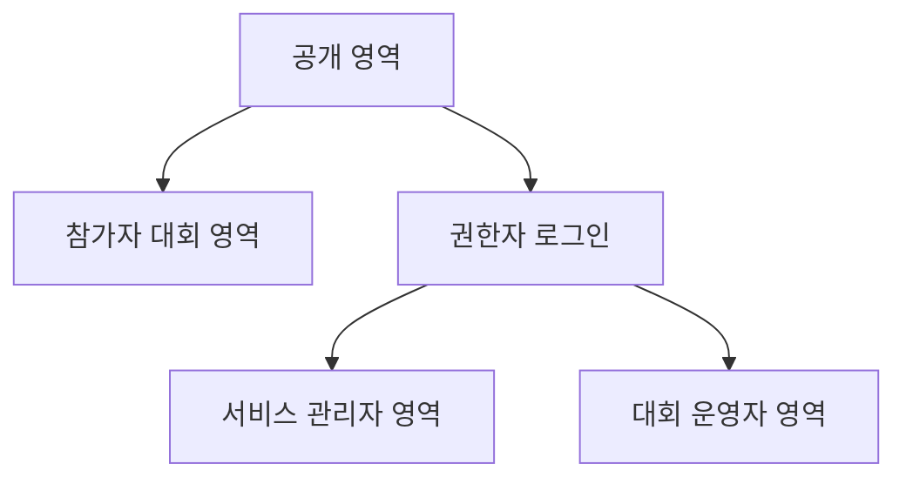

# 페이지와 API 요약

## 전체 화면 묶음



## 공개 페이지

| 페이지 | 목적 | 주요 API |
| --- | --- | --- |
| 메인 | 서비스 홈, 공지, 대회 진입 | `GET /public/home` |
| 서비스 공지 목록 | 공개 공지 조회 | `GET /public/service-notices` |
| 서비스 공지 상세 | 공지 본문 조회 | `GET /public/service-notices/{notice_id}` |
| 대회 목록 | 공개 대회 목록 조회 | `GET /public/contests` |
| 대회 상세 | 대회 개요, 참가 유형, 참가 진입 | `GET /public/contests/{contest_id}` |
| 운영 규정 | 공개 규정집 조회 | `GET /public/rules` |
| 공개 채점 현황 | 큐/노드 요약 공개 | `GET /public/judge-status` |

## 참가자 페이지

| 페이지 | 목적 | 주요 API |
| --- | --- | --- |
| 참가자 OTP 요청 | 이메일별 OTP 발송 | `POST /contests/{contest_id}/participant-login/otp/request` |
| 참가자 OTP 검증 | 이메일별 세션 시작, 팀 유형 반환 | `POST /contests/{contest_id}/participant-login/otp/verify` |
| 대회 워크스페이스 | 참가자 대회 홈 | `GET /contests/{contest_id}/workspace?team_member_email={email}` |
| 유형 워크스페이스 | 로그인된 팀 유형 홈 | `GET /contests/{contest_id}/divisions/{division_id}/workspace` |
| 문제 목록 | 참가 가능 문제 조회 | `GET /contests/{contest_id}/divisions/{division_id}/problems` |
| 문제 상세 | 문제 본문, 제한, 예제 조회 | `GET /contests/{contest_id}/problems/{problem_id}` |
| 제출 | 코드 제출 | `POST /contests/{contest_id}/problems/{problem_id}/submissions` |
| 내 제출 목록 | 팀 제출 기록 조회 | `GET /contests/{contest_id}/submissions` |
| 제출 상세 | 제출 상태와 메시지 조회 | `GET /contests/{contest_id}/submissions/{submission_id}` |
| 제출 상태 대기 | long polling으로 제출 상태 갱신 | `GET /contests/{contest_id}/submissions/{submission_id}/status:wait` |
| 스코어보드 | 공개/참가자용 유형별 순위 조회 | `GET /contests/{contest_id}/divisions/{division_id}/scoreboard` |
| 대회 공지 | 대회 공지 조회 | `GET /contests/{contest_id}/notices` |
| 질문 게시판 | 질문 목록과 상세 | `GET /contests/{contest_id}/boards` |

## 권한자 로그인

| 페이지 | 목적 | 주요 API |
| --- | --- | --- |
| 관리자 로그인 | 이메일/비밀번호 로그인 | `POST /auth/staff/login` |
| 현재 권한자 | 로그인 상태와 권한 조회 | `GET /auth/staff/me` |
| 토큰 갱신 | access token 재발급 | `POST /auth/staff/refresh` |
| 로그아웃 | refresh token 폐기 | `POST /auth/staff/logout` |
| 비밀번호 재설정 | 재설정 요청/확정 | `POST /auth/staff/password-reset/request`, `POST /auth/staff/password-reset/confirm` |

## 서비스 관리자 페이지

| 페이지 | 목적 | 주요 API |
| --- | --- | --- |
| 관리자 대시보드 | 서비스 운영 요약 | `GET /admin/dashboard` |
| 메뉴 조회 | 권한별 메뉴 구성 | `GET /admin/me/menus` |
| 대회 관리 | 대회 생성/조회/상태 변경 | `GET /admin/contests`, `POST /admin/contests` |
| 대회 상세 관리 | 대회 정보 수정과 lifecycle | `GET /admin/contests/{contest_id}`, `PATCH /admin/contests/{contest_id}` |
| 서비스 매니저 관리 | 매니저 초대, 권한 수정 | `GET /admin/service-managers`, `POST /admin/service-managers` |
| 서비스 공지 관리 | 공지 작성/수정/게시 | `GET /admin/service-notices`, `POST /admin/service-notices` |
| 채점 인프라 | 노드/큐/정책 조회와 제어 | `GET /admin/judge/dashboard`, `GET /admin/judge/nodes` |
| 메일 템플릿 | 초대/OTP 메일 템플릿 관리 | `GET /admin/mail-templates` |
| 감사 로그 | 운영 작업 이력 조회 | `GET /admin/audit-logs` |

## 대회 운영자 페이지

| 페이지 | 목적 | 주요 API |
| --- | --- | --- |
| 운영자 대시보드 | 대회 상태, 제출, 큐 요약 | `GET /operator/contests/{contest_id}/dashboard` |
| 대회 설정 | 일정, 공개, 채점 정책 수정 | `GET /operator/contests/{contest_id}/settings` |
| 참가 유형 관리 | 대회 안의 유형 조회/관리 | `GET /operator/contests/{contest_id}/divisions` |
| 운영 인력 | 운영자/매니저 관리 | `GET /operator/contests/{contest_id}/staff` |
| 참가팀 관리 | 팀 등록, 유형 지정, 이메일 식별자 관리 | `GET /operator/contests/{contest_id}/participants` |
| 문제 관리 | 문제 생성/수정/삭제 | `GET /operator/contests/{contest_id}/problems` |
| 제출 관리 | 전체 제출 조회 | `GET /operator/contests/{contest_id}/submissions` |
| 채점 이력 | 운영자 전용 전체 채점 이력 | `GET /operator/contests/{contest_id}/judge-history` |
| 제출 소스 조회 | 소스코드 확인 | `GET /operator/contests/{contest_id}/submissions/{submission_id}/source` |
| 내부 스코어보드 | 실제 점수와 프리즈 전 결과 조회 | `GET /operator/contests/{contest_id}/scoreboard/internal`, `GET /operator/contests/{contest_id}/divisions/{division_id}/scoreboard/internal` |
| 점수 조정 | 종료 후 수동 점수 보정 | `POST /operator/contests/{contest_id}/score-adjustments` |
| 최종 확정 | 공식 스코어보드 확정 | `POST /operator/contests/{contest_id}/scoreboard/finalize` |

## 정상 응답 포맷

단건:

```json
{
  "data": {
    "contest_id": "uuid",
    "title": "Zerone Contest"
  },
  "request_id": "req_01JABCDEF0000000000000000"
}
```

목록:

```json
{
  "data": [
    {
      "contest_id": "uuid",
      "title": "Zerone Contest"
    }
  ],
  "page": {
    "limit": 20,
    "next_cursor": null
  },
  "request_id": "req_01JABCDEF0000000000000000"
}
```

생성:

```json
{
  "data": {
    "id": "uuid",
    "created_at": "2026-05-02T12:00:00Z"
  },
  "request_id": "req_01JABCDEF0000000000000000"
}
```

## 에러 응답 포맷

```json
{
  "error": {
    "code": "permission_denied",
    "message": "You do not have permission to perform this action.",
    "request_id": "req_01JABCDEF0000000000000000",
    "details": {
      "required_permission": "contest.participant.update"
    }
  }
}
```

## API 테스트 작성 기준

각 API는 구현할 때 같은 기능 묶음 안에 테스트를 같이 만든다.

최소 테스트:

- 정상 요청은 expected status와 response body를 확인한다.
- request validation 실패는 `422 validation_error`를 확인한다.
- 인증이 필요한 API는 token 없음 `401 authentication_required`를 확인한다.
- 권한이 필요한 API는 권한 없음 `403 permission_denied` 또는 `403 scope_denied`를 확인한다.
- 상태 제약이 있는 API는 `409 invalid_state_transition`을 확인한다.
- 목록 API는 pagination cursor 또는 limit 동작을 확인한다.
- 유형이 있는 대회 API는 다른 `division_id`의 문제/스코어보드/제출 접근이 분리되는지 확인한다.

권장 테스트 파일 예시:

```text
backend/tests/api/test_staff_auth.py
backend/tests/api/test_admin_contests.py
backend/tests/api/test_operator_participants.py
backend/tests/api/test_participant_submissions.py
backend/tests/api/test_judge_internal_api.py
```

## 자주 나오는 에러

| HTTP | code | 의미 |
| --- | --- | --- |
| 401 | `authentication_required` | 로그인 필요 |
| 401 | `invalid_credentials` | 로그인 실패 |
| 403 | `permission_denied` | 권한 없음 |
| 403 | `scope_denied` | 권한은 있지만 해당 대회 scope가 아님 |
| 404 | `not_found` | 리소스 없음 또는 숨김 |
| 409 | `conflict` | 중복, 이미 처리됨 |
| 409 | `invalid_state_transition` | 현재 상태에서 할 수 없는 작업 |
| 409 | `role_conflict` | 같은 대회에서 운영진과 참가팀 역할 충돌 |
| 409 | `lease_conflict` | 채점 lease 불일치 |
| 422 | `validation_error` | 입력값 검증 실패 |
| 429 | `rate_limited` | 로그인/OTP 제한 초과 |
| 503 | `service_unavailable` | DB, 큐, 채점 인프라 일시 장애 |

## 공개 정책 메모

- `scheduled` 대회와 비공개 대회는 공개 API에서 `404 not_found`로 숨긴다.
- 종료 후 문제, 스코어보드, 제출 현황 공개 여부는 대회 설정에서 각각 제어한다.
- 종료 후 스코어보드는 자동 공개하지 않고 수동 공개만 허용한다.
